# MYSQL必知必会_笔记


[TOC]


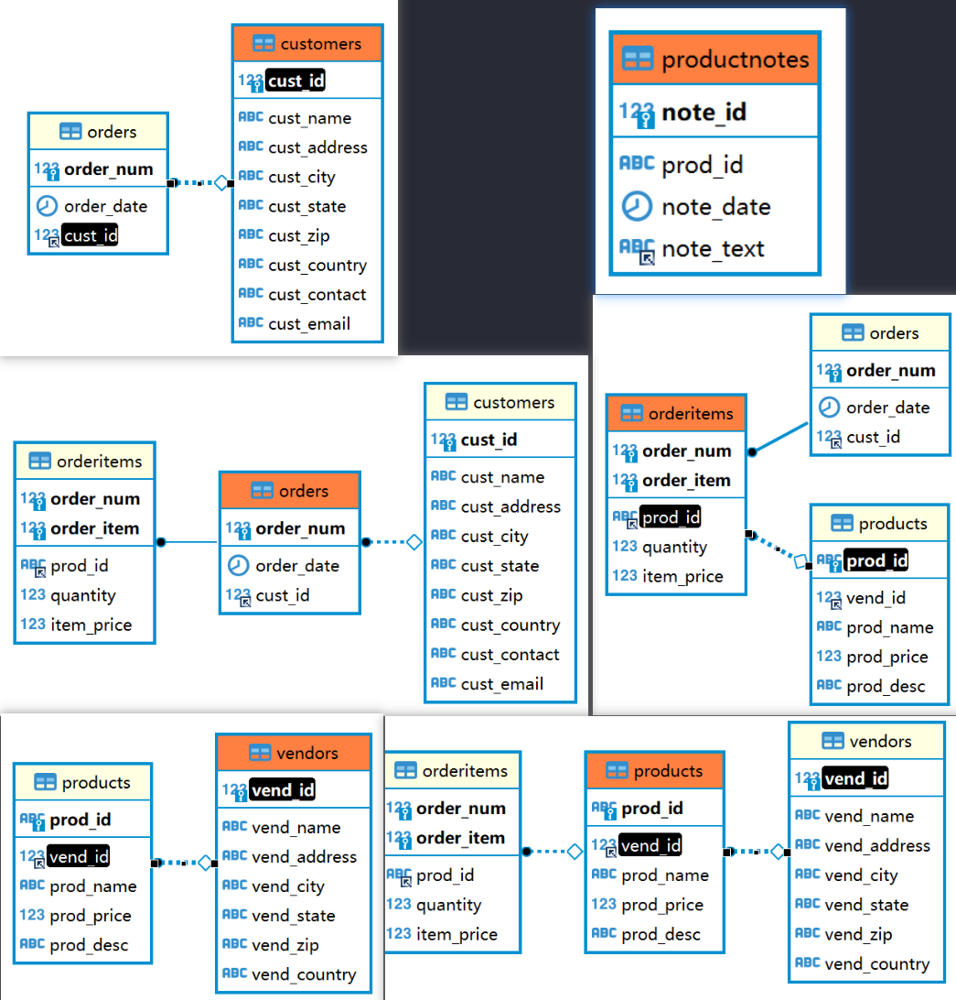

## 第1章 了解SQL

数据库（database） 保存有组织的数据的容器（通常是一个文件或一组文件）。

表（table） 某种特定类型数据的结构化清单。

列（column） 表中的一个字段。所有表都是由一个或多个列组成的。

行（row） 表中的一个记录。

主键（primary key）[插图]一列（或一组列），其值能够唯一区分表中每个行


## 第2章 MySQL简介

❑ 成本——MySQL是开放源代码的，一般可以免费使用（甚至可以免费修改）。

❑ 性能——MySQL执行很快（非常快）。

❑ 可信赖——某些非常重要和声望很高的公司、站点使用MySQL，这些公司和站点都用MySQL来处理自己的重要数据。

❑ 简单——MySQL很容易安装和使用。


```sql
$ mysql -u root -p
```

`-u` 用户名，`-p` 输入密码， `-h` 主机名， `-P` 端口，
`mysql --help` 命令行选项和参数列表

连接到数据库需要：主机名（本地为localhost）、端口（如果使用默认端口3306之外的端口）、合法的用户名、用户口令（如果需要）

可能需要root权限


## 第3章.使用MySQL

下载create.sql和populate.sql两个sql脚本文件，其中，create.sql包含创建6个数据库表的MySQL语句，populate.sql包含用来填充这些表的INSERT语句。执行下列操作：

```sql
--创建数据库
CREATE DATABASE crashcourse；
--使用数据库
--必须先使用USE打开数据库，才能读取其中的数据。
USE crashcourse;
--执行sql脚本
--需要指定文件的完整路径
--先执行create.sql，再执行populate.sql
SOURCE ~/create.sql;
SOURCE ~/populate.sql
```

以上为准备工作。

SHOW DATABASES；返回可用数据库的一个列表。包含在这个列表中的可能是MySQL内部使用的数据库（如例子中的mysql和information_schema）

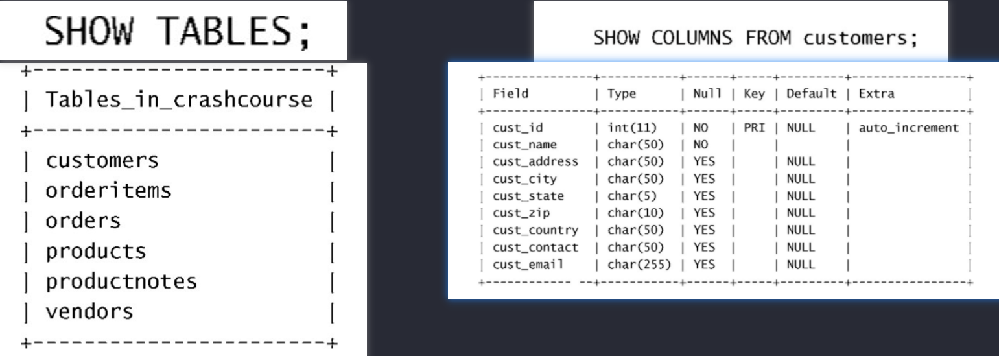

### 了解数据库和表

```sql
-- 显示可用的数据库列表
SHOW DATABASES;

-- 获得一个数据库内的表的列表
SHOW TABLES;

-- 用来显示表列
SHOW COLUMNS FROM customers;
DESCRIBE customers;

-- 其他SHOW语句
SHOW STATUS -- 用于显示广泛的服务器状态信息
SHOW CREATE DATABASE -- 显示创建特定数据库的MySQL语句
SHOW CREATE TABLE -- 显示创建特定表的语句
SHOW GRANTS -- 显示授予用户（所有用户或特定用户）的安全权限
SHOW ERRORS -- 显示服务器错误
SHOW WARNINGS -- 警告信息
```

## 第4章.检索数据

+ 使用空格 在处理SQL语句时，其中所有空格都被忽略。SQL语句可以在一行上给出，也可以分成许多行。多数SQL开发人员认为将SQL语句分成多行更容易阅读和调试。
+ SQL语句不区分大小写。
+ 多条SQL语句必须以分号（;）分隔。
+ DISTINCT关键字 只返回不同的值；  DISTINCT关键字应用于所有列而不仅是前置它的列

### SELECT语句

```sql
-- 检索单个列
-- 检索products表中的prod_name列
SELECT prod_name FROM products;

-- 检索多个列
-- 检索products表中的prod_id，prod_name和prod_price列，一般返回原始的、无格式的数据
SELECT prod_id, prod_name, prod_price FROM products;


-- 检索所有列
--检索products表中的所有列
SELECT * FROM products;

-- 检索不同的行
-- DISTINCT关键字必须直接放在列名的前面，不能部分使用DISTINCT，DISTINCT关键字应用于所有列而不仅是前置它的列。
SELECT DISTINCT vend_id FROM products;

-- 限制结果，指定返回前几行
-- 返回不多于5行 <=5
SELECT prod_name FROM products LIMIT 5;
-- 返回从第5行开始的后面5行 [5,9]
SELECT prod_name FROM products LIMIT 5,5;

-- 由于这个原因，MySQL 5支持LIMIT的另一种替代语法。
SELECT prod_name FROM products LIMIT 4 OFFSET 3;
-- 从行3开始取4行，就像LIMIT 3, 4一样。[3,6]
```

**检索出来的第一行为行0**，因此`LIMIT 1,1`检索出来的是第二行而不是第一行
MySQL 5 支持LIMIT的另一种替代语法
`LIMIT 4 OFFSET 3`为从行3开始取4行，同`LIMIT 3,4`

```
-- 使用完全限定的表名
SELECT products.prod_name FROM products;
SELECT products.prod_name FROM crashcoures.products;
```

## 第5章.排序检索数据

```sql
-- 排序数据
SELECT prod_name
FROM products
ORDER BY prod_name;
-- 按多个列排序
SELECT prod_id, prod_price, prod_name
FROM products
ORDER BY prod_price, prod_name;
```

对于上述例子中的输出，仅在多个行具有相同的prod_price 值时才对产品按prod_name进行排序。如果prod_price列中所有的值都是唯一的，则不会按prod_name排序。

DESC / ASC

```sql
-- 指定排序方向
-- 默认升序排序，降序使用DESC关键字
SELECT prod_id, prod_price, prod_name
FROM products
ORDER BY prod_price DESC;

SELECT prod_id, prod_price, prod_name
FROM products
ORDER BY prod_price DESC, prod_name;
```

DESC关键字只应用到直接位于其前面的列名。上例中，只对prod_price列指定DESC，对prod_name列不指定。
升序关键字ASC，可省略

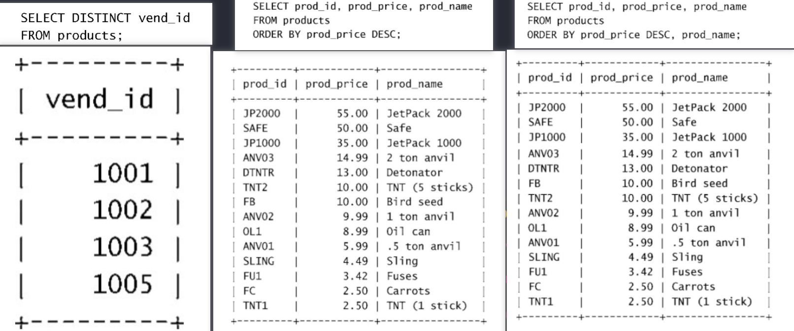


在字典（dictionary）排序顺序中，A被视为与a相同，这是MySQL（和大多数数据库管理系统）的默认行为。

### 找出一列中最高或最低的值

```sql
SELECT prod_price FROM products
ORDER BY prod_price DESC LIMIT 1;
```

给出ORDER BY句子时，应保证位于FROM句子之后，如果使用LIMIT，应位于ORDER BY之后。

## 第6章. 过滤数据

### 使用WHERE子句

```sql
-- 返回prod_price为2.50的行
SELECT prod_name, prod_price FROM products WHERE prod_price = 2.50
```

### WHERE子句操作符

| 符号    | 说明               |
| ------- | ------------------ |
| =       | 等于               |
| <>      | 不等于             |
| !=      | 不等于             |
| <       | 小于               |
| <=      | 小于等于           |
| >       | 大于               |
| >=      | 大于等于           |
| BETWEEN | 在指定的两个值之间 |

```sql
-- 检查单个值
-- 返回prod_name为Fuses的一行（匹配时默认不区分大小写）
SELECT prod_name, prod_price FROM products WHERE prod_name = 'fuses';

-- 列出小于10美元的所有产品
SELECT prod_name, prod_price FROM products WHERE prod_price < 10;

-- 列出小于等于10美元的所有产品
SELECT prod_name, prod_price FROM products WHERE prod_price <= 10;

-- 不匹配检查
-- 列出不是1003的所有产品
SELECT vend_id, prod_name FROM products WHERE vend_id <> 1003;
SELECT vend_id, prod_name FROM products WHERE vend_id != 1003;

-- 多个条件 and
SELECT vend_id, prod_name FROM products WHERE vend_id != 1003 and vend_id=1001;


-- 范围值检查
-- 检索价格在5-10美元之间的所有产品
SELECT prod_name, prod_price FROM products
WHERE prod_price BETWEEN 5 AND 10;

-- 空值检查
-- 返回价格为空的所有产品
SELECT prod_name FROM products WHERE prod_price IS NULL;
```


## 第7章.数据过滤

```sql
-- AND操作符
-- 检索由1003制造且价格小于等于10美元的所有产品的名称和价格
SELECT prod_id, prod_price, prod_name FROM products
WHERE vend_id = 1003 AND prod_price <= 10;

-- OR操作符
-- 检索由1002和1003制造的产品的名称和价格
SELECT prod_name, prod_price FROM products
WHERE vend_id = 1002 or vend_id = 1003;

-- 计算次序
-- AND的优先级高于OR
SELECT prod_name, prod_price FROM products
WHERE (vend_id = 1002 OR vend_id = 1003) AND prod_price >= 10;

-- IN操作符
-- 用来指定条件范围，取合法值的由逗号分隔的清单全部在圆括号中。
-- IN比OR执行更快，最大的优点是可以包含其他SELECT语句，能够更动态地建立WHERE子句
SELECT prod_name, prod_price FROM products WHERE vend_id IN (1002, 1003)
ORDER BY prod_name;

-- NOT操作符
-- 列出除1002，1003之外所有供应商供应的产品
SELECT prod_name, prod_price FROM products WHERE vend_id NOT IN (1002, 1003)
ORDER BY prod_name;
```

## 第8章 .用通配符进行过滤

### LIKE操作符

通配符（wildcard） 用来匹配值的一部分的特殊字符。

搜索模式（search pattern）由字面值、通配符或两者组合构成的搜索条件

LIKE指示MYSQL，后跟的搜索模式利用通配符匹配而不是直接相等匹配进行比较。

**百分号（%）通配符**  ---%表示任何字符出现任意次数

```sql
-- 百分号（%）通配符 ,表示任何字符出现任意次数
-- 例：找出所有jet起头的产品
SELECT prod_id, prod_name FROM products WHERE prod_name LIKE 'jet%';
-- 例：使用多个通配符,匹配任何位置包含anvil的值，不论它之前或之后出现什么字符
SELECT prod_id, prod_name FROM products WHERE prod_name LIKE '%anvil%';
-- 例：找出s起头e结尾的所有产品
SELECT prod_name FROM products WHERE prod_name LIKE 's%e';
```

%可以匹配0个字符，%代表搜索模式中给定位置的0个、1个或多个字符

尾空格可能会干扰通配符，例如，在保存词anvil时，如果它后面有一个或多个空格，则子句`WHERE prod_name LIKE '%anvil'`将不会匹配它们，因为在最后的l后有多余的字符。

解决这个问题的一个简单的办法是在搜索模 式最后附加一个%。一个更好的办法是使用函数去掉首尾空格。


**下划线（_）通配符, **  --下划线只匹配单个字符而不是多个字符

```sql
-- 下划线(_)通配符
-- 只匹配单个字符而不是多个字符
SELECT prod_id, prod_name FROM products WHERE prod_name LIKE '_ ton anvil';
```

### 使用技巧

- 不要过度使用通配符，如果其他操作符能够达到目的应该使用其他操作符
- 在确实需要使用通配符时，除非绝对有必要，否则不要把它们用在搜索的开始处。
  把通配符置于搜索模式的开始处搜索起来是最慢的。
- 仔细注意通配符的位置


## 第9章.用正则表达式进行搜索

### 使用MySQL正则表达式

#### 基本字符匹配

```sql
-- 例：检索prod_name包含文本1000的所有行
-- REGEXP后所跟的东西作为正则表达式处理
SELECT prod_name FROM products WHERE prod_name REGEXP '1000' -- 包含1000即可
ORDER BY prod_name;

-- `.`表示匹配任意一个字符
SELECT prod_name FROM products WHERE prod_name REGEXP '.000'
ORDER BY prod_name;
```

- LIKE和REGEXP的区别：
  LIKE '1000'匹配整个列值，等于'1000'时才会返回相应行，而REGEXP '1000'在列值内进行匹配，如果包含'1000'则会返回相应行。

```sql
-- 区分大小写
-- 使用关键字BINARY,例如
WHERE prod_name REGEXP BINARY 'JetPack .000';
```

#### 进行OR匹配

```sql
-- `|`为正则表达式的OR操作符，表示匹配其中之一
SELECT prod_name FROM products WHERE prod_name REGEXP '1000|2000|3000'
ORDER BY prod_name;
-- 可以给出两个以上的OR条件
`1000|2000|3000`
```

#### 匹配几个字符之一

```sql
-- `[]`表示匹配[]中的任意一个字符，例如`[123]`是`[1|2|3]`的缩写
SELECT prod_name FROM products WHERE prod_name REGEXP '[123] Ton'
ORDER BY prod_name;
-- output
+-------------+
| prod_name   |
+-------------+
|1 ton anvil  |
|2 ton anvil  |
+-------------+

-- 和直接使用OR的区别：
SELECT prod_name FROM products WHERE prod_name REGEXP '1|2|3 Ton'
ORDER BY prod_name
-- 匹配的是1 OR 2 OR 3 Ton，应该使用'[1|2|3] Ton'
-- output
+-------------+
| prod_name   |
+-------------+
|1 ton anvil  |
|2 ton anvil  |
|JetPack 1000 |
|JetPack 2000 |
|TNT (1 stick)|
+-------------+
```

字符集合也可以被否定，为否定一个字集，在集合的开始处放置`^`，例如`[^123]`匹配除这些字符的任何东西

#### 匹配范围

```sql
-- `[0123456789]`可以写成`[0-9]`，[1-3]和[6-9]也是合法的范围，其他范围如`[a-z]`
SELECT prod_name FROM products WHERE prod_name REGEXP '[1-5] Ton'
ORDER BY prod_name
-- output
+-------------+
|  prod_name  |
+-------------+
| .5 ton anvil|
| 1 ton anvil |
| 2 ton anvil |
+-------------+
```

#### 匹配特殊字符

```sql
-- 匹配'.'字符，错误使用为
SELECT vend_name FROM vendors WHERE vend_name REGEXP '.'
ORDER BY vend_name;
-- output
+---------------+
|   vend_name   |
+---------------+
| ACME          |
| Anvils R Us   |
| Furball Inc.  |
| Jet Set       |
| Jouets Et Ours|
| LT Supplies   |
+---------------+

-- 因为'.'为匹配任意字符，因此匹配特殊字符，必须用'\\'为前导

SELECT vend_name FROM vendors WHERE vend_name REGEXP '\\.'
ORDER BY vend_name;
-- output
+---------------+
|   vend_name   |
+---------------+
| Furball Inc.  |
+---------------+
```

正则表达式中具有特殊意义的所有字符都要通过这种方式转义
`\\`也用来引用元字符

| 元字符                         | 说明     |
| ------------------------------ | -------- |
| `\\f`                          | 换页     |
| `\\n`                          | 换行     |
| `\\r`                          | 回车     |
| `\\t`                          | 制表     |
| `\\v`                          | 纵向制表 |
| 为了匹配`\`本身，需要使用`\\\` |          |

#### 匹配字符类

| 类         | 说明                                                   |
| ---------- | ------------------------------------------------------ |
| [:alnum:]  | 任意字母和数字（同[a-zA-Z0-9]）                        |
| [:alpha:]  | 任意字符（同[a-zA-Z]）                                 |
| [:cntrl:]  | 空格和制表（同[\\\t]）                                 |
| [:digit:]  | ASCII控制字符（ASCII）0到31和127                       |
| [:graph:]  | 任意数字（同[0-9]）                                    |
| [:lower:]  | 任意小写字母（同[a-z]）                                |
| [:print:]  | 任意可打印字符                                         |
| [:punct:]  | 既不在[:alnum:]又不在[:cntrl:]中的任意字符             |
| [:space:]  | 包括空格在内的任意空白字符（同[\\\f\\\n\\\r\\\t\\\v]） |
| [:upper:]  | 任意大写字母（同[A-Z]）                                |
| [:xdigit:] | 任意十六进制数字（同[a-fA-F0-9]）                      |

#### 匹配多个实例

| 元字符 | 说明                         |
| ------ | ---------------------------- |
| *      | 0个或多个匹配                |
| +      | 1个或多个匹配（等于{1，}）   |
| ？     | 0个或1个匹配（等于{0，1}）   |
| {n}    | 指定数目的匹配               |
| {n,}   | 不少于指定数目的匹配         |
| {n.m}  | 匹配数目的范围（m不超过255） |

例：

```sql
SELECT prod_name FROM products WHERE prod_name REGEXP '\\([0-9] sticks?\\)'
ORDER BY prod_name
-- output
+---------------+
|   prod_name   |
+---------------+
| TNT (1 stick) |
| TNT (5 sticks)|
+---------------+

-- '\\('匹配'('
'[0-9]'匹配任意数字
'stick?'匹配'stick'和'sticks'
'\\)'匹配')'
```

例：匹配连在一起的4位数字

[:digit:]匹配任意数字 表示任意数字

```sql
SELECT prod_name FROM products WHERE prod_name REGEXP '[[:digit:]]{4}'
ORDER BY prod_name;
-- output
+---------------+
|   prod_name   |
+---------------+
| JetPack 1000  |
| JetPack 2000  |
+---------------+
-- 也可以写成 '[0-9][0-9][0-9][0-9]'
```

#### 定位符

| 元字符 | 说明       |
| ------ | ---------- |
| ^      | 文本的开始 |
| $      | 文本的结尾 |
| [:<:]  | 词的开始   |
| [:>:]  | 词的结尾   |

例：找出以一个数（包括小数点开头）开始的所有产品


```sql
SELECT prod_name FROM products WHERE prod_name REGEXP '^[0-9\\.]'
ORDER BY prod_name;
-- output
+---------------+
|   prod_name   |
+---------------+
| .5 ton anvil  |
| 1 ton anvil   |
| 2 ton anvil   |
+---------------+
```

LIKE和REGEXP的不同在于，LIKE匹配整个串而REGEXP匹配子串

可以在不使用数据库表的情况下用SELECT来测试正则表达式。

REGEXP检查总是返回0（没有匹配）或1（匹配）。

可以用带文字串的REGEXP来测试表达式，并试验它们。

```sql
SELECT 'hello' REGEXP '[0-9]';  
-- 返回0（因为文本hello中没有数字）
```


## 第10章.创建计算字段

### 计算字段

应用程序需要的数据需要通过从数据库中检索出转换、计算或格式化过的数据，而不是检索出数据，然后再在客户机应用程序或报告程序中重新格式化。

字段：基本上与列的意思相同，经常互换使用，不过数据库一般称为列，而属于字段通常用在计算字段的连接上。

### 拼接字段

拼接：将值联结到一起构成单个值

在SELECT语句中，可使用Concat()函数来拼接两个列。Concat()函数需要一个或多个指定的串，各个串之间用逗号分隔。

```sql
SELECT Concat(vend_name, ' (',vend_country,')') FROM vendors
ORDER BY vend_name;
#output
+-----------------------------------------+
| Concat(vendname,' (',vend_country,')') |
+-----------------------------------------+
| ACME (USA)                              |
| Anvils R Us (USA)                       |
| Furball Inc. (USA)                      |
| Jet Set (England)                       |
| Jouets Et Ours (France)                 |
| LT Supplies (USA)                       |
+-----------------------------------------+
```

使用 **RTrim()函数**可以删除右侧多余的空格来整理数据，例：

```sql
SELECT Concat(RTrim(vend_name),' (',RTrim(vend_country), ')')
FROM vendors
ORDER BY vend_name;
```

| 函数    | 说明           |
| ------- | -------------- |
| Trim()  | 去掉两边的空格 |
| LTrim() | 去掉左边的空格 |
| RTrim() | 去掉右边的空格 |

#### 使用别名

拼接的结果只是一个值，未命名。可以用AS关键字赋予别名

常见的用途包括在实际的表列名包含不符合规定的字符(如空格)时重新命名它，在原来的名字含混或容易误解时扩充它等等。
别名有时也称为导出列（derived column）

```sql
SELECT Concat(RTrim(vend_name),' (',RTrim(vend_country), ')') AS vend_title
FROM vendors
ORDER BY vend_name;
#output
+----------------------------+
| vend_title                 |
+----------------------------+
| ACME (USA)                 |
| Anvils R Us (USA)          |
| Furball Inc. (USA)         |
| Jet Set (England)          |
| Jouets Et Ours (France)    |
| LT Supplies (USA)          |
+----------------------------+
#指示SQL创建一个包含指定计算的名为vend_title的计算字段
```

### 执行算术计算

SELECT Now()利用Now()函数返回当前日期和时间

例：汇总物品的价格（单价乘以订购数量）

```sql
SELECT prod_id,quantity,item_price
FROM orderitems
WHERE order_num = 20005;   -- 先查看一下

+---------+----------+------------+
| prod_id | quantity | item_price |
+---------+----------+------------+
| ANV01   |       10 |       5.99 |
| ANV02   |        3 |       9.99 |
| TNT2    |        5 |      10.00 |
| FB      |        1 |      10.00 |
+---------+----------+------------+
4 rows in set (0.00 sec)

SELECT prod_id,
	   quantity,
       item_price,
       quantity * item_price AS expanded_price
FROM orderitems
WHERE order_num = 20005;
#output
+---------+----------+------------+----------------+
| prod_id | quantity | item_price | expanded_price |
+---------+----------+------------+----------------+
| ANV01   |       10 |       5.99 |          59.90 |
| ANV02   |        3 |       9.99 |          29.97 |
| TNT2    |        5 |      10.00 |          50.00 |
| FB      |        1 |      10.00 |          10.00 |
+---------+----------+------------+----------------+
```

| 操作符 | 说明 |
| ------ | ---- |
| +      | 加   |
| -      | 减   |
| *      | 乘   |
| /      | 除   |

SELECT Now() 利用 Now()函数返回当前日期和时间


## 第11章.使用数据处理函数

*函数没有SQL的可移植性强*

### 使用函数

大多数SQL实现支持以下类型的函数

- 用于处理文本串的文本函数
- 在数值数据上进行算术操作的数值函数
- 处理日期和时间值并从这些值中提取特定成分的日期和时间函数
- 返回DBMS正是用的特殊信息的系统函数

#### 文本处理函数

常用的文本处理函数

| 函数        | 说明              |
| ----------- | ----------------- |
| Left()      | 返回串左边的字符  |
| Length()    | 返回串的长度      |
| Locate()    | 找出串的一个子串  |
| Lower()     | 将串转换为小写    |
| LTrim()     | 去掉串左边的空格  |
| Right()     | 返回串右边的字符  |
| RTrim()     | 去掉串右边的空格  |
| Soundex()   | 返回串的SOUNDEX值 |
| SubString() | 返回子串的字符    |
| Upper()     | 将串转换为大写    |

```sql
SELECT vend_name, Upper(vend_name) AS vend_name_uppercase 
From vendors ORDER BY vend_name;

+----------------+---------------------+
| vend_name      | vend_name_uppercase |
+----------------+---------------------+
| ACME           | ACME                |
| Anvils R Us    | ANVILS R US         |
| Furball Inc.   | FURBALL INC.        |
| Jet Set        | JET SET             |
| Jouets Et Ours | JOUETS ET OURS      |
| LT Supplies    | LT SUPPLIES         |
+----------------+---------------------+
```


SOUNDEX是一个将任何文本转换为描述其语音表示的字母数字模式的算法，使得能对串进行发音比较而不是字母比较。MySQL提供对SOUNDEX的支持。

例：联系人Y.Lie输入错误为Y.Lee，使用SOUNDEX检索，匹配发音类似于Y.Lie的联系名

```sql
SELECT cust_name, cust_contact FROM customers
WHERE Soundex(cust_contact）= Soundex('Y Lie');
#output
+-------------+--------------+
| cust_name   | cust_contact |
+-------------+--------------+
| Coyote Inc. | Y Lee        |
+-------------+--------------+
```

#### 日期和时间处理函数

| 函数          | 说明                           |
| ------------- | ------------------------------ |
| AddDate()     | 增加一个日期（天、周等）       |
| AddTime()     | 增加一个时间（时、分等）       |
| CurDate()     | 返回当前日期                   |
| CurTime()     | 返回当前时间                   |
| Date()        | 返回日期时间的日期部分         |
| DateDiff()    | 计算两个日期之差               |
| Date_Add()    | 高度灵活的日期计算函数         |
| Date_Format() | 返回一个格式化的日期或时间串   |
| Day()         | 返回一个日期的天数部分         |
| DayOfWeek()   | 对于一个日期，返回对应的星期几 |
| Hour()        | 返回一个时间的小时部分         |
| Minute()      | 返回一个时间的分钟部分         |
| Month()       | 返回一个日期的月份部分         |
| Now()         | 返回当前日期和时间             |
| Second()      | 返回一个时间的秒部分           |
| Time()        | 返回一个日期时间的时间部分     |
| Year()        | 返回一个日期的年份部分         |

##### MySQL使用的日期格式

日期必须为格式yyyy-mm-dd
支持2位数字的年份，MySQL处理00-69为2000-2069，70-99为1970-1999，但使用4为数字年份更可靠。
例：

```sql
SELECT cust_id, order_num FROM orders
WHERE order_date = '2005-09-01';
```

order_date类型为datetime，样例表中的值全部具有时间值00：00：00，但是如果order_date的值为2005-09-01 11：30：05则上面的WHERE order_date = '2005-09-11'不会检索出这一行，因此必须使用Date()函数。

```sql
SELECT cust_id, order_num FROM orders
WHERE Date(order_date) = '2005-09-01';
```

例：检索出2005年9月下的所有订单

```sql
SELECT cust_id, order_num FROM orders
WHERE Date(order_date) BETWEEN '2005-09-01' AND '2005-09-30';
#BETWEEN把2005-09-01和2005-09-30定义为一个要匹配的日期范围。
#另一种方法
SELECT cust_id, order_num FROM orders
WHERE Year(roder_date) = 2005 AND Month(order_date) = 9;
```

#### 数值处理函数

| 函数   | 说明               |
| ------ | ------------------ |
| Abs()  | 返回一个数的绝对值 |
| Cos()  | 返回一个角度的余弦 |
| Exp()  | 返回一个数的指数值 |
| Mod()  | 返回除操作的余数   |
| Pi()   | 返回圆周率         |
| Rand() | 返回一个随机数     |
| Sin()  | 返回一个角度的正弦 |
| Sqrt() | 返回一个数的平方根 |
| Tan()  | 返回一个角度的正切 |


## 第12章.汇总数据

#### 聚集函数

+ 确定表中行数（或者满足某个条件或包含某个特定值的行数）
+  获得表中行组的和。
+ 找出表列（或所有行或某些特定的行）的最大值、最小值和平均值。

| 函数    | 说明             |
| ------- | ---------------- |
| AVG()   | 返回某列的平均值 |
| COUNT() | 返回某列的行数   |
| MAX()   | 返回某列的最大值 |
| MIN()   | 返回某列的最小值 |
| SUM()   | 返回某列值之和   |

聚集函数（aggregate function） 运行在行组上，计算和返回单个值的函数。


#### AVG()函数

例：返回products表中所有产品的平均价格

```sql
SELECT AVG(prod_price) AS avg_price FROM products;
```

例：返回特定供应商所提供产品的平均价格

```sql
SELECT AVG(prod_price) AS avg_price
FROM products
WHERE vend_id = 1003;
```

#### COUNT()函数

例：返回customer表中客户的总数(总行数，不管表列中包含的是空值（NULL）还是非空值。)

```sql
SELECT COUNT(*) AS num_cust FROM customers;
```

例：只对具有电子邮件地址的客户计数（）

```sql
SELECT COUNT(cust_email) AS num_cust
FROM customers;
```

如果指定列名，则指定列的值为空的行被COUNT()函数忽略，但如果COUNT()函数中用的是星号（*），则不忽略。

#### MAX()函数

例：返回products表中最贵的物品价格

```sql
SELECT MAX(prod_price) AS max_price
FROM products;
```

对非数值数据使用MAX()
MySQL允许将它用来返回任意列中的最大值，包括返回文本列中的最大值。在用于文本数据时，如果数据按相应的列排序，则MAX()返回最后一行。

MAX()函数忽略列值为NULL的行。


#### MIN()函数

例：

```sql
SELECT MIN(prod_price) AS min_price FROM products;
```

#### SUM()函数

返回指定列值的和（总计）
例：检索所订购物品的总数

```sql
SELECT SUM(quantity) AS items_ordered
FROM orderitems
WHERE order_num = 20005;
```

例：合计计算值，合计每项物品item_price*quantity，得出订单总金额

```sql
SELECT SUM(item_price*quantity) AS total_price
FORM orderitems
WHERE order_num = 20005;
```

### 聚集不同值

上述五个聚集函数都可以如下使用：

- 对所有的行执行计算，指定ALL参数或不给参数（ALL为默认）
- 只包含不同的值，指定DISTINCT参数

例：

```sql
SELECT AVG(DISTINCT prod_price) AS avg_price
FROM products
WHERE vend_id = 1003;
```

注意：==如果指定列名，则DISTINCT只能用于COUNT()。DISTINCT不能用于COUNT(*)==，因此不允许使用COUNT（DISTINCT）， 否则会产生错误。类似地，DISTINCT必须使用列名，不能用于计算或表达式。

### 组合聚集函数

SELECT语句可根据需要包含多个聚集函数

```sql
SELECT COUNT(*) AS num_items;
	   MIN(prod_price) AS price_min,
       MAX(prod_price) AS price_max,
       AVG(prod_price) AS price_avg
FROM products;
#output
+-----------+-----------+-----------+-----------+
| num_items | price_min | price_max | price_avg |
+-----------+-----------+-----------+-----------+
|        14 |      2.50 |     55.50 | 16.133571 |
+-----------+-----------+-----------+-----------+
```


## 第13章.分组数据

### 创建分组

例：根据vend_id分组，对每个分组分别计算总数

```sql
SELECT vend_id, COUNT(*) AS num_prods
FROM products
GROUP BY vend_id;

#output
+---------+-----------+
| vend_id | num_prods |
+---------+-----------+
|    1001 |         3 |
|    1002 |         2 |
|    1003 |         7 |
|    1005 |         2 |
+---------+-----------+
```

- GROUP BY 子句可以包含任意数目的列，使得能对分组进行嵌套，为数据分组提供更细致的控制
- 如果GROUP BY子句中中嵌套了分组，数据将在最后规定的分组上进行汇总。换句话说，在建立分组时，指定的所有列都一起计算（所以不能从个别的列取回数据）。
- GROUP BY子句中列出的每个列都必须是检索列或有效的表达式（但不能是聚集函数）。如果在SELECT中使用表达式，则必须在GROUP BY子句中指定相同的表达式。不能使用别名。
- 除聚集计算语句外，SELECT语句中的每个列都必须在GROUP BY子句中给出。
- 如果分组列中具有NULL值，则NULL将作为一个分组返回。如果列中有多行NULL值，它们将分为一组。
- ==GROUP BY子句必须出现在WHERE子句之后，ORDER BY子句之前。==


使用WITH ROLLUP关键字，可以得到每个分组以及每个分组汇总级别（针对每个分组）的值，如下所示：

```sql
SELECT vend_id, COUNT(*) AS num_prods
FROM products
GROUP BY vend_id WITH ROLLUP;

+---------+-----------+
| vend_id | num_prods |
+---------+-----------+
|    1001 |         3 |
|    1002 |         2 |
|    1003 |         7 |
|    1005 |         2 |
|    NULL |        14 |
+---------+-----------+
```

### 过滤分组

所学过的有关WHERE的所有这些技术和选项都适用于HAVING。它们的句法是相同的，只是关键字有差别。

WHERE指定的是行，不是分组，WHERE没有分组的概念

==使用HAVING过滤分组==

```sql
SELECT cust_id, COUNT(*) AS orders
FROM orders
GROUP BY cust_id
HAVING COUNT(*) >= 2;
#output
+---------+--------+
| cust_id | orders |
+---------+--------+
|   10001 |      2 |
+---------+--------+
```

==WHERE不起作用，因为过滤是基于分组聚集值而不是特定行值的。==

==WHERE在数据分组前进行过滤，HAVING在数据分组后进行过滤。==

例：列出具有2个（含）以上、价格为10（含）以上的产品的供应商

```sql
SELECT vend_id, COUNT(*) AS num_prods
FROM products
WHERE prod_price >= 10
GROUP BY vend_id
HAVING COUNT(*) >=2
#output
+---------+-----------+
| vend_id | num_prods |
+---------+-----------+
|    1003 |         4 |
|    1005 |         2 |
+---------+-----------+
```

### 分组和排序


|                  ORDER BY                  |                         GROUP BY                         |
| :----------------------------------------: | :------------------------------------------------------: |
|               排序产生的输出               |             分组行。但输出可能不是分组的顺序             |
| 任意列都可以使用，甚至非选择的列也可以使用 | 只可能使用选择列或者表达式列，而必须使用每个选择列表达式 |
|                 不一定需要                 |       如果与聚集函数一起使用列或表达式，则必须使用       |


例：检索总计订单价格大于等于50的订单 的订单号和总计订单价格

```sql
SELECT order_num, SUM(quantity*item_price) AS ordertotal
FROM orderitems
GROUP BY order_num
HAVING SUM(quantity*item_price) >= 50
ORDER BY ordertotal DESC;

+-----------+------------+
| order_num | ordertotal |
+-----------+------------+
|     20007 |    1000.00 |
|     20005 |     149.87 |
|     20008 |     125.00 |
|     20006 |      55.00 |
+-----------+------------+

```

### SELECT子句顺序

SELECT子句及其顺序

| 子句     | 说明               | 是否必须使用           |
| -------- | ------------------ | ---------------------- |
| SELECT   | 要返回的列或表达式 | 是                     |
| WHERE    | 从中检索数据的表   | 仅在从表选择数据时使用 |
| GROUP BY | 分组说明           | 尽在按组计算聚集是使用 |
| HAVING   | 组级过滤           | 否                     |
| ORDER BY | 输出排序顺序       | 否                     |
| LIMIT    | 要检索的行数       | 否                     |

上述子句使用时必须遵循该顺序

## 第14章.使用子查询


例：列出订购物品TNT2的所有客户

1. 检索包含物品TNT2的所有订单的编号
2. 检索具有前一步骤列出的订单编号的所有客户的ID
3. 检索前一步骤返回的所有客户ID的客户信息

```SQL
#(1)
SELECT order_num FROM orderitems WHERE prod_id = 'TNT2';
#output
+-----------+
| order_num |
+-----------+
|     20005 |
|     20007 |
+-----------+
#(2)
SELECT cust_id FROM orders WHERE order_num IN (20005,20007);
+-----------+
|  cust_id  |
+-----------+
|     10001 |
|     10004 |
+-----------+

#(1)+(2)
SELECT cust_id
FROM orders
WHERE order_num IN (
                    SELECT order_num FROM orderitems 
                    WHERE prod_id = 'TNT2');

+---------+
| cust_id |
+---------+
|   10001 |
|   10004 |
+---------+

#(3)
SELECT cust_name, cust_contact FROM customers WHERE cust_id IN (10001, 10004);

+----------------+--------------+
| cust_name      | cust_contact |
+----------------+--------------+
| Coyote Inc.    | Y Lee        |
| Yosemite Place | Y Sam        |
+----------------+--------------+

#(1)+(2)+(3)
SELECT cust_name, cust_contact 
FROM customers
WHERE cust_id IN(SELECT cust_id FROM orders
				 WHERE order_num IN(SELECT order_num FROM orderitems
                 					 WHERE prod_id ='TNT2'));
#output
+----------------+--------------+
| cust_name      | cust_contact |
+----------------+--------------+
| Coyote Inc.    | Y Lee        |
| Yosemite Place | Y Sam        |
+----------------+--------------+
```

在WHERE子句中使用子查询应保证SELECT语句有与WHERE子句中相同数目的列。

### 作为计算字段使用子查询

需要显示customers表中每个客户的订单总数，订单与相应的客户ID存储在orders表中

1. 从customers表中检索客户列表
2. 对于检索出的每个客户，统计其在orders表中的订单数目

```sql
# 对客户10001的订单进行计数
SELECT COUNT(*) AS orders FROM orders WHERE cust_id = 10001;
+--------+
| orders |
+--------+
|      2 |
+--------+

# 为了对每个客户执行COUNT(*)计算，应该将COUNT(*)作为一个子查询
# 必须注意限制有歧义性的列名。 WHERE orders.cust_id = customers.cust_id
SELECT cust_name, cust_state, (SELECT COUNT(*) FROM orders
                              WHERE orders.cust_id = customers.cust_id) AS orders
FROM customers ORDER BY cust_name;

+----------------+------------+--------+
| cust_name      | cust_state | orders |
+----------------+------------+--------+
| Coyote Inc.    | MI         |      2 |
| E Fudd         | IL         |      1 |
| Mouse House    | OH         |      0 |
| Wascals        | IN         |      1 |
| Yosemite Place | AZ         |      1 |
+----------------+------------+--------+

```

**相关子查询**(correlated subquery)：涉及外部查询的子查询
在任何时候只要列明可能有多义性，就必须使用这种语法（表明和列名由一个句点分隔）


## 第15章.联结表

### 联结

#### 关系表

例如：两个表，一个存储供应商信息，另一个存储产品信息。vendors表包含所有供应商信息，每个供应商占一行，每个供应商应具有唯一的标识，称为主键（primary key）。products表只存储产品信息，除了存储供应商ID之外不存储其他的供应商信息。vendors表的主键又叫products的外键，它将vendors表与products表关联，利用供应商ID能从vendors表中找出相应供应商的详细信息。

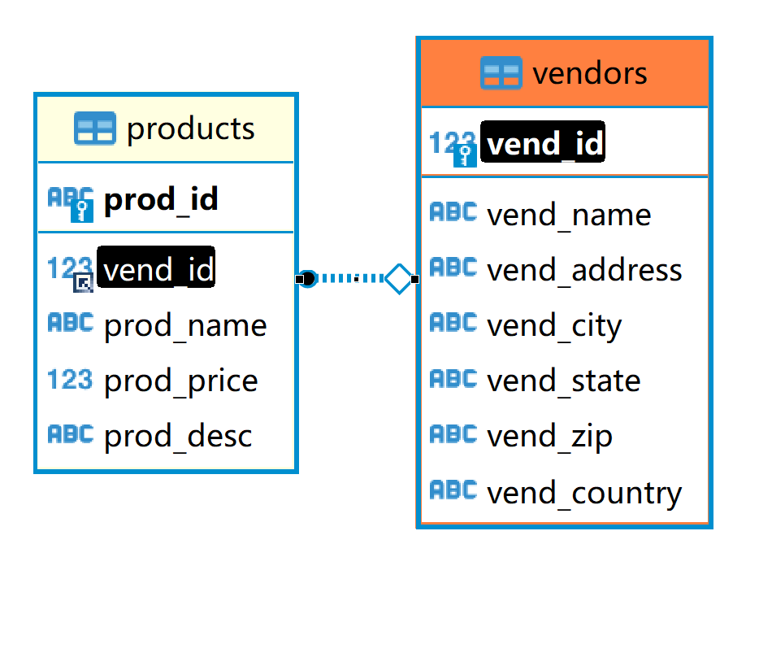

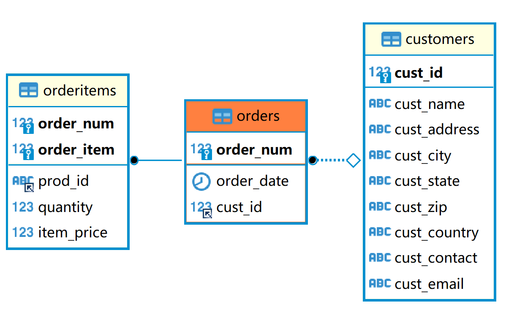

外键：外键为某个表中的一列，它包含另一个表的主键值，定义了两个表之间的关系。

例：定义外键

```sql
ALTER TABLE orderitems
ADD CONSTRAINT fk_irderitems_orders
FOREIGN KEY (order_num) REFERENCES orders(order_num);

ALTER TABLE orderitems
ADD CONSTRAINT fk_irderitems_products
FOREIGN KEY (prod_id) REFERENCES products(prod_id);

ALTER TABLE orders
ADD CONSTRAINT fk_irderitems_customers
FOREIGN KEY (cust_id) REFERENCES customers(cust_id);

ALTER TABLE products
ADD CONSTRAINT fk_irderitems_vendors
FOREIGN KEY (vend_id) REFERENCES vendors(vend_id);
```


维护引用完整性 

+ 在使用关系表时，仅在关系列中插入合法的数据非常重要，如果在products表中插入拥有非法供应商ID（即没有在vendors表中出现）的供应商生产的产品，则这些产品是不可访问的，因为它们没有关联到某个供应商。

### 创建连结

```sql
SELECT vend_name, prod_name, prod_price FROM vendors, products
WHERE vendors.vend_id = products.vend_id
ORDER BY vend_name, prod_name;
#output
+-------------+----------------+------------+
| vend_name   | prod_name      | prod_price |
+-------------+----------------+------------+
| ACME        | Bird seed      |      10.00 |
| ACME        | Carrots        |       2.50 |
| ACME        | Detonator      |      13.00 |
| ACME        | Safe           |      50.00 |
| ACME        | Sling          |       4.49 |
| ACME        | TNT (1 stick)  |       2.50 |
| ACME        | TNT (5 sticks) |      10.00 |
| Anvils R Us | .5 ton anvil   |       5.99 |
| Anvils R Us | 1 ton anvil    |       9.99 |
| Anvils R Us | 2 ton anvil    |      14.99 |
| Jet Set     | JetPack 1000   |      35.00 |
| Jet Set     | JetPack 2000   |      55.00 |
| LT Supplies | Fuses          |       3.42 |
| LT Supplies | Oil can        |       8.99 |
+-------------+----------------+------------+
```

两个表用WHERE子句联结

笛卡儿积：由没有连结条件的表关系返回的结果为笛卡尔积，检索出的行的数目将是第一个表中的行数乘以第二个表中的行数。

不要忘了WHERE子句 应该保证所有联结都有WHERE子句，否则MySQL将返回比想要的数据多得多的数据。


#### 内部连结

等值联结：基于两个表之间的相等测试，也叫内部连结

可以使用另一种语法来明确指定联结的类型

```sql
SELECT vend_name, prod_name, prod_price
FROM vendors INNER JOIN products
ON vendors.vend_id = products.vend_id;
# 这两个句子结果完全一致。
SELECT vend_name, prod_name, prod_price
FROM vendors,products
WHERE vendors.vend_id = products.vend_id;

+-------------+----------------+------------+
| vend_name   | prod_name      | prod_price |
+-------------+----------------+------------+
| Anvils R Us | .5 ton anvil   |       5.99 |
| Anvils R Us | 1 ton anvil    |       9.99 |
| Anvils R Us | 2 ton anvil    |      14.99 |
| LT Supplies | Fuses          |       3.42 |
| LT Supplies | Oil can        |       8.99 |
| ACME        | Detonator      |      13.00 |
| ACME        | Bird seed      |      10.00 |
| ACME        | Carrots        |       2.50 |
| ACME        | Safe           |      50.00 |
| ACME        | Sling          |       4.49 |
| ACME        | TNT (1 stick)  |       2.50 |
| ACME        | TNT (5 sticks) |      10.00 |
| Jet Set     | JetPack 1000   |      35.00 |
| Jet Set     | JetPack 2000   |      55.00 |
+-------------+----------------+------------+
```

FROM 子句的组成部分，以INNER JOIN指定，联结条件用ON子句

#### 联结多个表

```sql
SELECT prod_name, vend_name, prod_price, quantity
FROM orderitems, products, vendors
WHERE products.vend_id = vendors.vend_id
AND orderitems.prod_id = products.prod_id
AND order_num = 20005;

+----------------+-------------+------------+----------+
| prod_name      | vend_name   | prod_price | quantity |
+----------------+-------------+------------+----------+
| .5 ton anvil   | Anvils R Us |       5.99 |       10 |
| 1 ton anvil    | Anvils R Us |       9.99 |        3 |
| TNT (5 sticks) | ACME        |      10.00 |        5 |
| Bird seed      | ACME        |      10.00 |        1 |
+----------------+-------------+------------+----------+

#显示编号为20005的订单中的物品。订单物品存储在orderitems表中，按每个产品的ID存储。
它引用products表中的产品。这些产品通过供应商ID联结到vendors表中相应的供应商
```

例：返回订购产品INT2的客户列表

```sql
SELECT cust_name,cust_contact
FROM customers, orders, orderitems
WHERE customers.cust_id = orders.cust_id
AND orderitems.order_num = orders.order_num
AND prod_id = 'TNT2';

+----------------+--------------+
| cust_name      | cust_contact |
+----------------+--------------+
| Coyote Inc.    | Y Lee        |
| Yosemite Place | Y Sam        |
+----------------+--------------+
```

## 第16章.创建高级联结

### 使用表别名

```sql
SELECT Concat(RTrim(vend_name),'(', Rtrim(vend_country),')') AS vend_title
FROM vendors ORDER BY vend_name;

+------------------------+
| vend_title             |
+------------------------+
| ACME(USA)              |
| Anvils R Us(USA)       |
| Furball Inc.(USA)      |
| Jet Set(England)       |
| Jouets Et Ours(France) |
| LT Supplies(USA)       |
+------------------------+
```

别名除了用于列名和计算字段外，SQL还允许给表起别名，这样做有两个主要理由：

- 缩短SQL语句
- 允许在单条SELECT语句中多次使用相同的表。

例：

```sql
SELECT cust_name, cust_contact
FROM customers AS c, orders AS o, orderitems AS oi
WHERE c.cust_id = o.cust_id
AND oi.order_num = o.order_num
AND prod_id = 'TNT2';

+----------------+--------------+
| cust_name      | cust_contact |
+----------------+--------------+
| Coyote Inc.    | Y Lee        |
| Yosemite Place | Y Sam        |
+----------------+--------------+
```

### 使用不同类型的联结

#### 自联结

例：如果某物品（ID为DTNTR）存在问题，因此想知道生产该物品的供应商生产的其他物品是否也存在这些问题。此查询要求首先找到ID为DTNTR的物品的供应商，然后找出这个供应商生产的其他物品。

```sql
#子查询
SELECT prod_id, prod_name
FROM products
WHERE vend_id = (SELECT vend_id FROM products WHERE prod_id = 'DTNTR');

#output
+---------+----------------+
| prod_id | prod_name      |
+---------+----------------+
| DTNTR   | Detonator      |
| FB      | Bird seed      |
| FC      | Carrots        |
| SAFE    | Safe           |
| SLING   | Sling          |
| TNT1    | TNT (1 stick)  |
| TNT2    | TNT (5 sticks) |
+---------+----------------+
#使用自联结
SELECT p1.prod_id, p1.prod_name
FROM products AS p1, products AS p2
WHERE p1.vend_id = p2.vend_id
AND p2.prod_id = 'DTNTR';
```

#### 自然联结

无论何时对表进行联结，应该至少有一个列出现在不止一个表中（被联结的列）。标准的联结（内部联结）返回所有数据，甚至相同的列多次出现，自然联结排除多次出现，使每个列只返回一次。

自然联结是这样一种联结，其中你只能选择那些唯一的列，这一版是通过使用通配符，对所有其他表的列使用明确的字集来完成的。

```sql
SELECT c.*, o.order_num, o.order_date, oi.prod_id, oi.quantity, oi.item_price
FROM customers AS c, orders AS o, orderitems AS oi
WHERE c.cust_id = o.cust_id
AND oi.order_num = o.order_num
AND prod_id = 'FB';
```

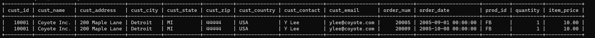

这个例子中，通配符只对第一个表使用所有其他列明确列出，所以没有重复的列被检索出来。

#### 外部联结

有时候需要包含没有关联的那些行

例：需要联结来完成以下工作

- 对每个客户下了多少订单进行计数，包括那些至今尚未下订单的客户
- 列出所有产品及订购数量，包括没人订购的产品
- 计算平均销售规模，包括那些至今尚未下订单的客户

```sql
#内部联结
SELECT customers.cust_id, orders.order_num
FROM customers INNER JOIN orders
ON customers.cust_id = orders.cust_id;

+---------+-----------+
| cust_id | order_num |
+---------+-----------+
|   10001 |     20005 |
|   10001 |     20009 |
|   10003 |     20006 |
|   10004 |     20007 |
|   10005 |     20008 |
+---------+-----------+
#外部联结
SELECT customers.cust_id, orders.order_num
FROM customers LEFT OUTER JOIN orders
ON customers.cust_id = orders.cust_id;

# 上面的例子使用LEFT OUTER JOIN从FROM子句的左边表（customers表）中选择所有行

-- 外部联结语法类似。可以检索所有客户，包括没有订单的客户。
+---------+-----------+
| cust_id | order_num |
+---------+-----------+
|   10001 |     20005 |
|   10001 |     20009 |
|   10002 |      NULL |
|   10003 |     20006 |
|   10004 |     20007 |
|   10005 |     20008 |
+---------+-----------+
```


在使用OUTER JOIN语法时，必须使用RIGHT或LEFT关键字指定包括其所有行的表。（RIGHT指出的是OUTER JOIN右边的表，而LEFT指出的是OUTER JOIN左边的表。）上面的例子中从customers中选择所有的行。

```sql
SELECT customers.cust_id, orders.order_num
FROM customers RIGHT OUTER JOIN orders  -- ON的时候有不同，必须按照left right 保持一致。
ON orders.cust_id = customers.cust_id;
```

### 使用带聚集函数的联结

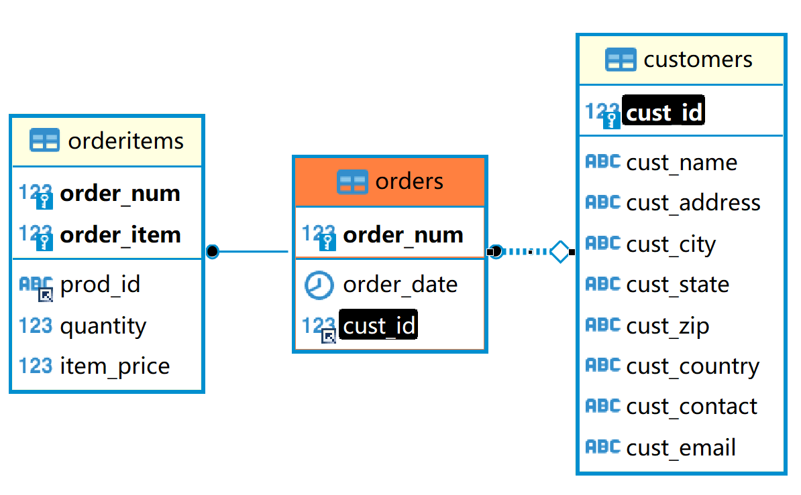

例：检索所有客户及每个客户所下的订单数

```sql
SELECT customers.cust_name, customers.cust_id, COUNT(orders.order_num) AS num_ord
FROM customers INNER JOIN orders
ON customers.cust_id = orders.cust_id
GROUP BY customers.cust_id;

+----------------+---------+---------+
| cust_name      | cust_id | num_ord |
+----------------+---------+---------+
| Coyote Inc.    |   10001 |       2 |
| Wascals        |   10003 |       1 |
| Yosemite Place |   10004 |       1 |
| E Fudd         |   10005 |       1 |
+----------------+---------+---------+
```

此SELECT语句使用INNER JOIN将customers和orders表互相关联。GROUP BY子句按客户分组数据，因此，函数调用COUNT(orders.order_num)对每个客户的订单计数，将它作为num_ord返回。


聚集函数也可以方便地与其他联结一起使用。例：

```sql
SELECT customers.cust_name, customers.cust_id, COUNT(orders.order_num) AS num_ord
FROM customers LEFT OUTER JOIN orders
ON customers.cust_id = orders.cust_id
GROUP BY customers.cust_id;

+----------------+---------+---------+
| cust_name      | cust_id | num_ord |
+----------------+---------+---------+
| Coyote Inc.    |   10001 |       2 |
| Mouse House    |   10002 |       0 |
| Wascals        |   10003 |       1 |
| Yosemite Place |   10004 |       1 |
| E Fudd         |   10005 |       1 |
+----------------+---------+---------+
```

这个例子使用左外部联结来包含所有客户，甚至包含那些没有任何下订单的客户。

### 使用联结和联结条件

- 注意所使用的联结类型，一般我们使用内部联结，但使用外部联结也是有效的。
- 保证使用正确的联结条件，否则将返回不正确的数据。
- ==应该总是提供联结条件，否则会得出笛卡尔积。==
- 在一个联结中可以包含多个表，甚至对于每个联结可以采用不同的联结类型。应该在一起测试他们前分别测试每个联结。


## 第17章.组合查询

### 组合查询

MySQL允许执行多个查询并将结果作为单个查询结果返回。
两种情况：

- ==在单个查询中从不同的表返回类似结构的数据==
- 对单个表执行多个查询，按单个查询返回数据

### 创建组合查询

#### 使用UNION并查

给出每条SELECT语句，在各条语句之间放上关键字UNION
例：需要价格小于等于5的所有物品的一个列表，并且包含供应商1001和1002生产的所有物品

```sql
#单条语句
SELECT vend_id, prod_id, prod_price
FROM products
WHERE prod_price <= 5;

SELECT vend_id, prod_id, prod_price
FROM products
WHERE vend_id IN (1001,1002);

#组合上述语句
SELECT vend_id, prod_id, prod_price
FROM products
WHERE prod_price <= 5
UNION
SELECT vend_id, prod_id, prod_price
FROM products
WHERE vend_id IN (1001, 1002);

#等于
SELECT vend_id, prod_id, prod_price
FROM products
WHERE prod_price <= 5
OR vend_id IN (1001, 1002);

+---------+---------+------------+
| vend_id | prod_id | prod_price |
+---------+---------+------------+
|    1001 | ANV01   |       5.99 |
|    1001 | ANV02   |       9.99 |
|    1001 | ANV03   |      14.99 |
|    1003 | FC      |       2.50 |
|    1002 | FU1     |       3.42 |
|    1002 | OL1     |       8.99 |
|    1003 | SLING   |       4.49 |
|    1003 | TNT1    |       2.50 |
+---------+---------+------------+
```

#### UNION规则

- UNION 必须由两条或两条以上的SELECT语句组成，语句之间用关键字UNION分隔
- UNION中的每个查询必须包含先沟通的列、表达式或聚集函数
- ==列数据类型必须兼容：类型不必完全相同，但必须是DBMS可以隐含地转换的类型==

#### 包含或取消重复的行

UNION从查询结果集中==自动去除了重复的行==，如果需要返回所有行，可以使用UNION ALL

#### 对组合查询结果排序

使用ORDER BY子句排序，只能使用一条ORDER BY子句，必须在最后一条SELECT语句之后。


```sql
SELECT vend_id, prod_id, prod_price
FROM products
WHERE prod_price <= 5
UNION
SELECT vend_id, prod_id, prod_price
FROM products
WHERE vend_id IN (1001, 1002)
ORDER BY vend_id, prod_price ;

+---------+---------+------------+
| vend_id | prod_id | prod_price |
+---------+---------+------------+
|    1001 | ANV01   |       5.99 |
|    1001 | ANV02   |       9.99 |
|    1001 | ANV03   |      14.99 |
|    1002 | FU1     |       3.42 |
|    1002 | OL1     |       8.99 |
|    1003 | FC      |       2.50 |
|    1003 | TNT1    |       2.50 |
|    1003 | SLING   |       4.49 |
+---------+---------+------------+
```


## 第18章.全文本搜索

**并非所有引擎都支持全文本搜索**
MyISAM支持，InnoDB不支持

LIKE、正则表达式的限制

- 性能：由于被搜索行不断增加，这些搜索可能非常耗时
- 明确控制：很难明确控制匹配什么和不匹配什么
- 智能化的结果：不能提供一种智能化的选择结果的方法，例如：一个特殊词的搜索将会返回包含该词的所有行而不区分包含单个匹配的行和多个匹配的行。

### 使用全文本搜索

为了进行全文本搜索，必须索引被搜索的列，而且要随着数据的改变不断地重新索引。在对表列进行适当设计后，MySQL会自动进行所有的索引和重新索引。
在索引之后，SELECT可与Match()和Against()一起使用以实际执行搜索。

#### 启用全文本搜索支持

一般在创建表时启用全文本搜索
CREATE TABLE语句接收FULLTEXT子句，它给出被索引列的一个逗号分隔的列表
例：

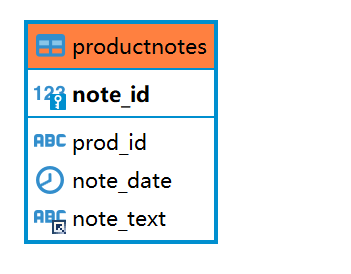

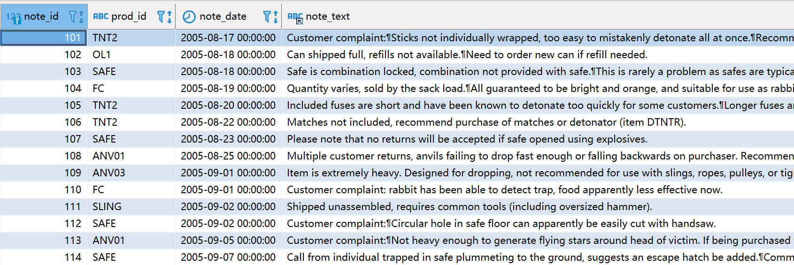

```sql
CREATE TABLE productnotes
(
	note_id int NOT NULL AUTO_INCREMENT,
    pord_id char(10) NOT NULL,
    note_date datetime NOT NULL.
    note_text text NULL,
    PRIMARY KEY(note_id),
    FULLTEXT(note_text)
)ENGINE=MyISAM;

-- 设定存储引擎为MyISAM
```

可以在创建表时指定FULLTEXT或在稍后指定（所有数据必须立即索引）
**不要在导入数据时使用FULLTEXT** 应线导入所有数据再修改表，定义FULLTEXT

#### 进行全文本搜索

Match() 指定被搜索的列
Against() 指定要使用的搜索表达式

```SQL
SELECT note_text
FROM productnotes
WHERE Match(note_text) Against('rabbit');

-- 相同于
SELECT note_text
FROM productnotes
WHERE Match(note_text) LIKE '%rabbit%' ;
```


传递个Match()的值必须与FULLTEXT()定义中的相同。

除非使用BINARY方式，否则全文本搜索不区分大小写

全文本搜索对结果排序，具有较高等级的行先返回

```SQL
SELECT note_text,
Match(note_text) Against('rabbit') AS rank
FROM productnotes;
```

显示所有行及他们的等级

#### 使用查询扩展

例如找出所有提到anvils的注释，和与搜索有关的其他行，即使它们不包含这个词

```sql
#不使用扩展查询的 一个简单的全文本搜索
SELECT note_text
FROM productnotes
WHERE Match(note_text) Against('anvils');


+------------------------------------------------------------------------------+
| note_text                                                                    |
+------------------------------------------------------------------------------+
| Multiple custoer returns, anvils failing to drop fast enough or falling      |
| backwords on purchaser, Recomend that customer considers using havier        |
| anvils.                                                                      |
+------------------------------------------------------------------------------+


#使用扩展查询
SELECT note_text
FROM productnotes
WHERE Match(note_text) Against('anvils' WITH QUERY EXPANSION);


搜索结果中包括的词也会作为拓展的依据，再次检索。
+------------------------------------------------------------------------------+
| note_text                                                                    |
+------------------------------------------------------------------------------+
| Multiple custoer returns, anvils failing to drop fast enough or falling      |
| backwords on purchaser, Recomend that customer considers using havier        |
| anvils.                                                                      |
| Customer complaint: Sticks not individually wrapped, too easy to mistakenly  |
| detonate all at once. Recommend individual wrapping.                         |
| Customer compliant: Not heavy enouth to generate flying stars around heardof |
| victim. If veing purchased for dropping, recommend ANV02 or ANV03 instead.   |
| Please note that no returns will be accepted if safe opened using explosives.|
| Customer complaint: rabbit has been able to detect trap, food apparently     |
| less effective now.                                                          |
| Customer complaint: Circular hole in safe floor can apparently be easily cut |
| with handsaw.                                                                |
| Matches not include, recomend purchase of matches or detonator (item DTNTR)  |
+------------------------------------------------------------------------------+
```

返回7行，第一行包含anvils，因此等级最高，第二行与anvils无关，但包含第一行中的两个次，因此被检索出来。

#### 布尔文本搜索

可以提供如下内容的细节：

- 要匹配的词
- 要排斥的词， 如果某行包含这个词，则不返回该行，即使它包含其他指定的词也是如此
- 排列提示 指定某些词比其他词更重要，更重要的词等级更高
- 表达式分组
- 另外一些内容

```sql
SELECT note_text
FROM productnotes
WHERE Match(note_text) Against('heavy' IN BOOLEAN MODE);
```

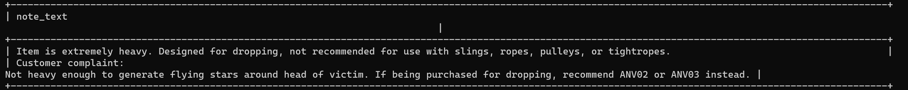

例：匹配包含heavy但不包含任意以rope开始的词的行

```sql
SELECT note_text
FROM productnotes
WHERE Match(note_text) Against('heavy -rope*' IN BOOLEAN MODE);
```

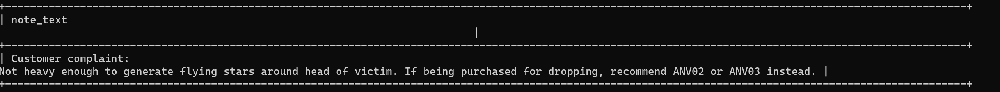

**MySQL4.x版本中使用-ropes而不是-rope* **


#### **全文本布尔操作符**

| 布尔操作符 | 说明                                                         |
| ---------- | ------------------------------------------------------------ |
| +          | 包含，词必须存在                                             |
| -          | 排除，词必须不出现                                           |
| >          | 包含，而且增加等级值                                         |
| <          | 包含，且减少等级                                             |
| ()         | 把词组成子表达式（允许这些子表达式作为一个组被包含、排除、排列等） |
| ~          | 取消一个词的排序值                                           |
| *          | 取消一个词的排序值                                           |
| ""         | 定义一个短语（与单个词的列表不一样，它匹配整个短语以便包含或排除这个短语） |

例：

```sql
SELECT note_text
FROM productnotes
WHERE Match(note_text) Against('+rabbit +bait' IN BOOLEAN MODE);
#匹配包含词rabbit和bait的行。

SELECT note_text
FROM productnotes
WHERE Match(note_text) Against('rabbit bait' IN BOOLEAN MODE);
#匹配包含rabbit和bait中的至少一个词的行

SELECT note_text
FROM productnotes
WHERE Match(note_text) Against('"rabbit bait"' IN BOOLEAN MODE);
#匹配rabbit bait而不是匹配两个词

SELECT note_text
FROM productnotes
WHERE Match(note_text) Against('>rabbit <bait' IN BOOLEAN MODE);
#匹配rabbit和carrot，增加前者的等级，降低后者的等级

SELECT note_text
FROM productnotes
WHERE Match(note_text) Against('+safe +(<combination)' IN BOOLEAN MODE);
#匹配词safe和combination，降低后者的等级

```

#### 全文本搜索的使用说明

- 在索引全文本数据时，短词被忽略且从索引中排除。短词定义为 那些具有3个或3个以下字符的词（如果需要，这个数目可以更改）。
- MySQL带有一个内建的非用词（stopword）列表，这些词在索引全文本数据时总是被忽略。如果需要，可以覆盖这个列表（请参阅MySQL文档以了解如何完成此工作）。
- 许多词出现的频率很高，搜索它们没有用处（返回太多的结果）。 因此，MySQL规定了一条50%规则，如果一个词出现在50%以上 的行中，则将它作为一个非用词忽略。50%规则不用于IN BOOLEAN MODE。
- 如果表中的行数少于3行，则全文本搜索不返回结果（因为每个词 或者不出现，或者至少出现在50%的行中）。
- 忽略词中的单引号。例如，don't索引为dont。
- 不具有词分隔符（包括日语和汉语）的语言不能恰当地返回全文 本搜索结果。
- 如前所述，==仅在MyISAM数据库引擎中支持全文本搜索。==


## 第19章.插入数据

INSERT

- 插入完整的行
- 插入行的一部分
- 插入多行
- 插入某些查询的结果

### 插入完整的行

 INSERT语句一般不会产生输出。

```sql
INSERT INTO Customers
VALUES(NULL,
    'Pep E. LaPew',
    '100 Main Street',
    'Los Angles',
    'CA',
    '90046',
    'USA',
    NULL,
    NULL);
```

语法简单但不安全。更安全的方法为：

```sql
INSERT INTO customers(cust_name,
    cust_address,
    cust_city,
    cust_state,
    cust_zip,
    cust_country,
    cust_contact,
    cust_email)
VALUES('Pep E. LaPew',
    '100 Main Street',
    'Los Angeles',
    'CA',
    '90046'
    'USA'
    NULL,
    NULL);
    
#下面的INSERT语句填充所有列（与前面的一样），但以一种不同的次序填充。
#因为给出了列名，所以插入结果仍然正确：
INSERT INTO customers(cust_name,
    cust_contact,
    cust_email,
    cust_address,
    cust_city,
    cust_state,
    cust_zip,
    cust_country)
VALUES('Pep E. LaPew',
    NULL,
    NULL,
    '100 Main Street',
    'Los Angles',
    'CA',
    '90046',
    'USA');
```

不管哪种INSSERT语法，都必须给出VALUES的正确数目，如果不提供列名，则必须给每个表提供一个值。如果提供列名，则必须对每个列出的列值给出一个值。

列名被明确列出时，可以省略列,如果表的定义允许则可以省略列

- 该列定义为允许NULL值（无值或空值）
- 在表定义中给出默认值。

如果数据检索是最重要的（通常是这样），则你可以通过在INSERT和INTO之间添加关键字LOW_PRIORITY，指示MySQL降低INSERT语句的优先级，如下所示：

```sql
INSERT LOW_PRIORITY INTO ...;
```


### 插入多个行

```SQL
INSERT INTO customers(cust_name,
    cust_address,
    cust_city,
    cust_state,
    cust_zip,
    cust_country)
VALUES('Pep E. LaPew',
    '100 Main Street'
    'Los Angeles',
    'CA',
    '90046',
    'USA');
INSERT INTO customers(cust_name,
    cust_address,
    cust_city,
    cust_state,
    cust_zip,
    cust_country)
VALUES('M. Martian',
    '42 Galaxy Way'
    'New York',
    'NY',
    '11213',
    'USA');

#使用组合句
INSERT INTO customers(cust_name,
    cust_address,
    cust_city,
    cust_state,
    cust_zip,
    cust_country)
VALUES('Pep E. LaPew',
    '100 Main Street'
    'Los Angeles',
    'CA',
    '90046',
    'USA')，

    ('M. Martian',
    '42 Galaxy Way'
    'New York',
    'NY',
    '11213',
    'USA');

#单条INSERT语句有多组值，每组值用一对圆括号括起来，用逗号分隔。
```

### 插入检索出的数据

```SQL
INSERT INTO customers(cust_id,
    cust_contact,
    cust_email,
    cust_name,
    cust_address,
    cust_city,
    cust_state,
    cust_zip,
    cust_country)
SELECT cust_id,
    cust_contact,
    cust_email,
    cust_name,
    cust_address,
    cust_city,
    cust_state,
    cust_zip,
    cust_country
FROM custnew;
```


## 第20章.更新和删除数据

### 更新数据

UPDATE

- 更新表中特定行
- 更新表中所有行


例：客户10005更新电子邮件

```sql
UPDATE customers
SET cust_email = 'elmer@fudd.com'
WHERE cust_id = 10005;
```

例：更新多个列

```sql
UPDARTE customers
SET cust_name = 'The Fudds',
cust_email = 'elmer@fudd.com'
WHERE cust_id = 10005;
```

在更新多个列时，只需要使用单个SET命令，每个“列=值”对之间 用逗号分隔（最后一列之后不用逗号）。在此例子中，更新客户10005的cust_name和cust_email列。

**IGNORE关键字**:

如果用UPDATE语句更新多行，并且在更新这些 行中的一行或多行时出一个现错误，则整个UPDATE操作被取消 （错误发生前更新的所有行被恢复到它们原来的值）。为即使是发生错误，也继续进行更新，可使用IGNORE关键字，如下所示：

```sql
UPDATE IGNORE customers…
```


为了删除某列的值，可以设置为NULL

```sql
UPDATE customers
SET cust_email = NULL
WHERE cust_id = 10005;
```

### 删除数据

使用DELETE语句

- 从表中删除特定的行
- 从表中删除所有的行

```sql
DELETE FROM customers
WHERE cust_id = 10006;
```

### 更新和删除的指导原则

下面是许多SQL程序员使用UPDATE或DELETE时所遵循的习惯。

- 除非确实打算更新和删除每一行，否则绝对不要使用不带WHERE子句的UPDATE或DELETE语句。
- 保证每个表都有主键，尽可能像WHERE子句那样使用它（可以指定各主键、多个值或值的范围）。
- ==在对UPDATE或DELETE语句使用WHERE子句前，应该先用SELECT进行测试，保证它过滤的是正确的记录，以防编写的WHERE子句不正确。==
- 使用强制实施引用完整性的数据库，这样MySQL将不允许删除具有与其他表相关联的数据的行。

## 补充

MySQL的注释方法
一共有三种，分别为

```sql
#单行注释可以使用"#"
-- 单行注释也可以使用"--"，注意与注释之间有空格
/*
用于多行注释
*/
```


## 第21章.创建和操纵表

### 创建表

#### 创建表基础

CREATE TABLE

- 新表的名字，在关键字CREATE TABLE之后给出
- 表列的名字和定义，用逗号分隔。
  例：

```sql
CREATE TABLE customers IF NOT EXISTS
(
    cust_id int NOT NULL AUTO_INCREMENT,
    cust_name char(50) NOT NULL,
    cust_address char(50) NULL,
    cust_city char(50) NULL,
    cust_state char(5) NULL,
    cust_zip char(10) NULL,
    cust_country char(50) NULL,
    cust_contact char(50) NULL,
    cust_email char(255) NULL,
    PRIMARY KEY (cust_id)
) ENGINE=InnoDB;
```

在创建新表时，指定的表名必须不存在，否则将出错。如果要防止意外覆盖已有的表，SQL要求首先手工删除该表，然后再重建它，而不是简单地用创建表语句覆盖它。

如果你仅想在一个表不存在时创建它，应该在表名后给出IF NOT EXISTS。这样做不检查已有表的模式是否与你打算创建的表模式相匹配。它只是查看表名是否存在，并且仅在表名不存在时创建它。

#### 使用NULL值

NULL值就是没有值或缺值。允许NULL值的列也允许在插入行时不给出该列的值。

每个表列或者是NULL列或者是NOT NULL列，这种状态在创建时由表的定义规定
例：

```sql
CREATE TABLE orders
(
    order_num int NOT NULL AUTO_INCREMENT,
    order_date datetime NOT NULL,
    cust_id int NOT NULL,
    PRIMARY KEY (order_num)
) ENGINE-InnoDB;
```

例：混合了NULL和NOT NULL列的表

```sql
CREATE TABLE vendors
(
    vend_id int NOT NULL AUTO_INCREMENT,
    vend_name char(50) NOT NULL,
    vend_address char(50) NULL,
    vend_city char(50) NULL,
    vend_state char(5) NULL,
    vend_zip char(10) NULL,
    vend_country char(50) NULL,
    PRIMARY KEY(vend_id)
) ENGINE = InnoDB;
```

#### 主键

==主键值必须唯一==。如果主键使用单个列，则它的值必须唯一。如果使用多个列，则这些列的组合值必须唯一。

例：创建多个列组成的主键

```sql
CREATE TABLE orderitems
(
    order_num int NOT NULL,
    order_item int NOT NULL,
    prod_id char(10) NOT NULL,
    quantity int NOT NULL,
    item_price decimal(8,2) NOT NULL,
    PRIMARY KEY (order_num, order_item)
)ENGINE = InnoDB;
```

#### 使用AUTO_INCREMENT

==AUTO_INCREMENT告诉MySQL，本列每当增加一行时自动增量==。每次 执行一个INSERT操作时，MySQL自动对该列增量（从而才有这个关键字AUTO_INCREMENT），给该列赋予下一个可用的值。这样给每个行分配一个唯一的cust_id，从而可以用作主键值。

覆盖AUTO_INCREMENT:如果一个列被指定为AUTO_INCREMENT，则它需要使用特殊的值吗？你可以简单地INSERT语句中指定一个值，只要它是唯一的（至今尚未使用过）即可，该值将被用来替代自动生成的值。后续的增量将开始使用该手工插入的值。

#### 指定默认值Default

```sql
CREATE TABLE orderitems
(
    order_num int NOT NUL,
    order_item int NOT NULL,
    prod_id char(10) NOT NULL,
    quantity int NOT NULL DEFAULT 1,
    item_price decimal(8,2) NOT NULL,
    PRIMARY KEY (order_num,order_item)
) ENGINE = InnoDB;
```

MySQL不允许使用函数作为默认值，只支持常量

#### 引擎类型

- InnoDB是一个可靠的事务处理引擎，它不支持全文本搜索；
- MEMORY在功能等同于MyISAM，但由于数据存储在内存（不是磁盘） 中，速度很快（特别适合于临时表）；
- MyISAM是一个性能极高的引擎，它支持全文本搜索，但不支持事务处理。
  引擎类型可以混用。
- ==外键不能跨引擎 混用引擎类型有一个大缺陷==。外键（用于强制实施引用完整性）不能跨引擎，即使用一个引擎的表不能引用具有使用不同引擎的表的外键。

### 更新表 ALTER TABLE

使用ALTER TABLE更改表的结构，必须给出以下信息：

- 在ALTER TABLE之后给出要更改的表名（该表必须存在，否则将出错）；
- 所做更改的列表。

例：添加一个列

```sql
ALTER TABLE vendors
ADD vend_phone CHAR(20);
```

例：删除刚增加的列

```sql
ALTER TABLE vendors
DROP COLUMN vend_phone;
```


为了对单个表进行多个更改，可以使用单条ALTER TABLE语句，每个更改用逗号分隔

复杂的表结构更改一般需要手动删除过程，它涉及以下步骤：

- 用新的列布局创建一个新表；
- 使用INSERT SELECT语句从旧表复制数据到新表。如果有必要，可使用转换函数和计算字段；
- 检验包含所需数据的新表；
- 重命名旧表（如果确定，可以删除它）；
- 用旧表原来的名字重命名新表；
- 根据需要，重新创建触发器、存储过程、索引和外键。

==使用ALTER TABLE要极为小心，应该在进行改动前做一个完整的备份（模式和数据的备份）==。数据库表的更改不能撤销，如果增加了不需要的列，可能不能删除它们。类似地，如果删除了不应该删除的列，可能会丢失该列中的所有数据。


### 删除表

```sql
DROP TABLE customers2;
```

### 重命名表

```sql
RENAME TABLE customers2 TO customers;

#对多个表重命名
RENAME TABLE backup_customers TO customers,
	         backup_vendors TO vendors,
             backup_products TO products;
```


## 第22章.使用视图

### 视图

例：从3个表中检索数据

```sql
SELECT cust_name, cust_contact FROM customers, orders, orderitems
WHERE customers.cust_id = orders.cust_id
AND orderitems,order_num = orders.order_num
AND prod_id = 'TNT2';

#此查询用来检索订购了某个特定产品的客户。假如把整个查询包装成一个名为productcusotmers的虚拟表，则
SELECT cust_name, cust_contact FROM productcustomers
WHERE prod_id = 'TNT2';
```

productcustomers是一个视图。

#### 为什么使用视图

- 重用SQL语句。
- 简化复杂的SQL操作。在编写查询后，可以方便地重用它而不必知道它的基本查询细节。
- 使用表的组成部分而不是整个表。
- 保护数据。可以给用户授予表的特定部分的访问权限而不是整个表的访问权限。
- 更改数据格式和表示。视图可返回与底层表的表示和格式不同的数据。

#### 视图的规则和限制

- ==与表一样，视图必须唯一命名==（不能给视图取与别的视图或表相同的名字）。
- 对于可以创建的视图数目没有限制。
- 为了创建视图，必须具有足够的访问权限。这些限制通常由数据库管理人员授予。
- 视图可以嵌套，即可以利用从其他视图中检索数据的查询来构造一个视图。
- ORDER BY可以用在视图中，但如果从该视图检索数据SELECT中也含有ORDER BY，那么该视图中的ORDER BY将被覆盖。
- 视图不能索引，也不能有关联的触发器或默认值。
- 视图可以和表一起使用。例如，编写一条联结表和视图的SELECT语句。

### 使用视图

- 视图用CREATE VIEW语句来创建。
- 使用SHOW CREATE VIEW viewname；来查看创建视图的语句
- 用DROP删除视图，其语法为DROP VIEW viewname;
- 更新视图时，可以先用DROP再用CREATE，也可以直接用CREATE OR REPLACE VIEW。如果要更新的视图不存在，则第2条更新语句会创建一个视图；如果要更新的视图存在，则第2条更新语句会替换原有视图。

#### 利用视图简化复杂的联结

```sql
CREATE VIEW productcustomers AS
SELECT cust_name, cust_contact, prod_id
FROM customers, orders, orderietms
WHERE customers.cust_id = orders.cust_id
AND orderitems.order_num = orders.order_num;
```

创建可重用的视图：创建不受特定数据限制的视图是一种好办法。例如，上面创建的视图返回生产所有产品的客户而不仅仅是生产TNT2的客户。扩展视图的范围不仅使得它能被重用，而且甚至更有用。这样做不需要创建和维护多个类似视图。

#### 用视图重新格式化检索出的数据

```sql
SELECT Concat(RTrim(vend_name), ' (', RTrim(vend_country), ')') AS vend_title
FROM vendors
ORDER BY vend_name;
```

现在，假如经常需要这个格式的结果。不必在每次需要时执行联结，创建一个视图，每次需要时使用它即可。为把此语句转换为视图，可按如下进行：

```sql
CREATE VIEW vendorlocations AS
SELECT Concat(RTrim(vend_name), ' (', RTrim(vend_country), ')') AS vend_title
FROM vendors
ORDER BY vend_name;
```

这条语句使用与以前的SELECT语句相同的查询创建视图。为了检索出以创建所有邮件标签的数据，可如下进行：

```sql
SELECT *
FROM vendorlocations;

SHOW CREATE VIEW vendorlocations ; -- 查看设定的语句

DROP VIEW vendorlocations; -- 删除视图
+-------------------------+
| vend_title              |
+-------------------------+
| ACME (USA)              |
| Anvils R Us (USA)       |
| Furball Inc. (USA)      |
| Jet Set (England)       |
| Jouets Et Ours (France) |
| LT Supplies (USA)       |
+-------------------------+

```

#### 用视图过滤不想要的数据

例：排除没有电子邮件地址的用户

```sql
CREATE VIEW customeremaillist AS
SELECT cust_id, cust_name, cust_email
FROM customers
WHERE cust_email IS NOT NULL;

SELECT * FROM customeremaillist;
```

#### 使用视图与计算字段

```sql
SELECT prod_id, quantity, item_price, quantity*item_price AS expanded_price
FROM orderitems
WHERE order_num = 20005;
#将其转换为视图
CREATE VIEW orderitemsexpanded AS
SELECT order_num, prod_id, quantity, item_price, quantity*item_price AS expanded_price
FROM orderitems;

SELECT *
FROM orderitemsexpanded
WHERE order_num = 20005;
```

#### 更新视图

==视图的数据能否更新视情况而定。==

通常，视图是可更新的（即，可以对它们使用INSERT、UPDATE和DELETE）。更新一个视图将更新其基表（可以回忆一下，视图本身没有数据）。==如果你对视图增加或删除行，实际上是对其基表增加或删除行==。 但是，并非所有视图都是可更新的。基本上可以说，如果MySQL不能正确地确定被更新的基数据，则不允许更新（包括插入和删除）。这实际上意味着，如果视图定义中有以下操作，则不能进行视图的更新：

- 分组（使用GROUP BY和HAVING）；
- 联结；
- 子查询；
- 并；
- 聚集函数（Min()、Count()、Sum()等）；
- DISTINCT；
- 导出（计算）列。


## 第23章 使用存储过程

### 存储过程

存储过程简单来说，就是为以后的使用而保存的一条或多条MySQL语句的集合。可将其视为批文件，虽然它们的作用不仅限于批处理。

### 为什么使用存储过程

- 通过把处理封装在容易使用的单元中，简化复杂的操作（正如前面例子所述）。
- 由于不要求反复建立一系列处理步骤，这保证了数据的完整性。如果所有开发人员和应用程序都使用同一（试验和测试）存储过程，则所使用的代码都是相同的。 这一点的延伸就是防止错误。需要执行的步骤越多，出错的可能 性就越大。防止错误保证了数据的一致性。
- 简化对变动的管理。如果表名、列名或业务逻辑（或别的内容）有变化，只需要更改存储过程的代码。使用它的人员甚至不需要知道这些变化。
  这一点的延伸就是安全性。通过存储过程限制对基础数据的访问减少了数据讹误（无意识的或别的原因所导致的数据讹误）的机会。
- ==提高性能。因为使用存储过程比使用单独的SQL语句要快。==
- 存在一些只能用在单个请求中的MySQL元素和特性，存储过程可以使用它们来编写功能更强更灵活的代码（在下一章的例子中可以看到。）
  换句话说，使用存储过程有3个主要的好处，即简单、安全、高性能。显然，它们都很重要。不过，在将SQL代码转换为存储过程前，也必须知道它的一些缺陷。

### 使用存储过程

#### 执行存储过程

MySQL称存储过程的执行为调用，因此，MySQL执行存储过程的语句为CALL
例：

```sql
CALL productpricing(
					@pricelow.
                    @pricehigh,
                    @priceaverage);
```

其中，执行名为productpricing的存储过程，它计算并返回产品的最低、最高和平均价格。

#### 创建存储过程

例：一个返回产品平均价格的存储过程

```sql
CREATE PROCEDURE productpricing()
BEGIN
	SELECT Avg(prod_price) AS priceaverage
    FROM products;
END;
```

使用存储过程：

```sql
CALL productpricing();
```

##### MySQL命令行客户机的分隔符

默认的MySQL语句分隔符为';'。MySQL命令行实用程序也使用';'作为语句分隔符。如果命令行实用程序要解释存储过程自身内的';'字符，则它们最终不会成为存储过程的成分，这会使存储过程中的SQL出现句法错误。
解决办法是临时更改命令行实用程序的语句分隔符，如下所示：

```sql
DELIMITER &&    -- 声明&&为开始
CREATE PROCEDURE productpricing()
BEGIN
	SELECT Avg(prod_price) AS priceaverage
    FROM products;
END &&

-- 恢复为原来的语句分隔符
DELIMITER ;


-- 其中，DELIMITER//告诉命令行实用程序使用//作为新的语句结束分隔符，可以看到标志存储过程结束的END定义为END//而不是END;。这样，存储过程体内的;仍然保持不动，并且正确地传递给数据库引擎。最后，为恢复为原来的语句分隔符，可使用DELIMITER ;。除\符号外，任何字符都可以用作语句分隔符。
```

#### 删除存储过程

```sql
DROP PROCEDURE productpricing;
```

仅当存在时删除使用`DROP PROCEDURE IF EXISTS`

#### 使用参数

```sql
CREATE PROCEDURE productpricing(
	OUT pl DECIMAL(8,2),
    OUT ph DECIMAL(8,2),
    OUT pa DECIMAL(8,2)
)
BEGIN
	SELECT Min(prid_price)
    INTO pl
    FROM products;
    SELECT Max(prod_price)
    INTO ph
    FROM products;
    SELECT AVG(prod_price)
    INTO pa
    FROM prodcts;
END;
```

此存储过程接受3个参数：pl存储产品最低价格，ph存储产品最高价格，pa存储产品平均价格。

每个参数必须具有指定的类型，这里使用十进制值。关键字OUT指出相应的参数用来从存储过程传出一个值（返回给调用者）。

MySQL支持IN（传递给存储过程）、OUT（从存储过程传出，如这里所用）和INOUT（对存储过程传入和传出）类型的参数。

存储过程的代码位于BEGIN和END语句内，如前所见，它们是一系列SELECT语句，用来检索值，然后保存到相应的变量（通过指定INTO关键字）。

为调用此修改过的存储过程，必须指定3个变量名，如下所示：

```SQL
CALL productpricing(@pricelow,
					@pricehigh,
                    @priceaverage);
#为了显示检索出的产品价格，可如下进行
SELECT @priceaverage；
#为了获得3个值，可以使用如下语句
SELECT @pricehigh, @pricelow, @priceaverage;
```

例：使用IN和OUT参数，ordertotal接收订单号并返回该订单的合计。

```sql
CREATE PROCEDURE ordertotal(
	IN onumber INT,
    OUT ototal DECIMAL(8,2)
)
BEGIN
	SELECT Sum(item_price*quantity)
    FROM orderitems
    WHERE order_num = onumber
    INTO ototal;
END;

#调用:必须传递两个参数，1为订单号，2为包含计算出来的合计的变量名
CALL ordertotal(20005, @total);

#显示合计
SELECT @total;
```

#### 建立智能存储过程

例：获得与以前一样的订单合计，但需要对合计增加营业税，不过只针对某些顾客

- 获得合计
- 把营业税有条件地添加到合计
- 返回合计

```sql
-- Name: ordertotal
-- Parameters: onumber = order number
--             taxable = 0 if not taxable, 1 if taxable
--             ototal  = order total variable

CREATE PROCEDURE ordertotal(
	IN onumber TNT,
    IN taxable BOOLEAN,
    OUT ototal DECIMAL(8,2)
)COMMENT 'Obtain order total, optionally adding tax'
BEGIN
    -- DECLARE variable for total
    DECLARE total DECIMAL (8,2);
    -- DECLARE tax percentage
    DECLARE taxrate INT DEFAULT 6;

    -- Get the order total
    SELECT Sum(item_price*quantity)
    FROM orderitems
    WHERE order_num = onumber
    INTO total;

    -- Is this taxable?
    IF taxable THEN
    	-- Yes, so add taxrate to the total
        SELECT total +(total/100*taxrate) INTO total;
    END IF;

    --And finally, save to our variable
    SELECT total INTO ototal;
END;

--试验
CALL ordertotal(20005, 0, @total);
SELECT @total;

CALL ordertotal(20005, 1, @total);
SELECT @total;

```

此存储过程有很大的变动。首先，增加了注释（前面放置--）。在存储过程复杂性增加时，这样做特别重要。添加了另外一个参数taxable，它是一个布尔值（如果要增加税则为真，否则为假）。在存储过程体中，用DECLARE语句定义了两个局部变量。DECLARE要求指定变量名和数据类型，它也支持可选的默认值（这个例子中的taxrate的默 认被设置为6%）。SELECT语句已经改变，因此其结果存储到total（局部变量）而不是ototal。IF语句检查taxable是否为真，如果为真，则用另一SELECT语句增加营业税到局部变量total。最后，用另一SELECT语句将total（它增加或许不增加营业税）保存到ototal。
本例子中的存储过程在CREATE PROCEDURE语句中包含了一个COMMENT值。它不是必需的，但如果给出，将在SHOW PROCEDURE STATUS的结果中显示

#### 检查存储过程

显示用来创建一个存储过程的CREATE语句，使用

```sql
SHOW CREATE PROCEDURE ordertotal;
```

为获得包括何时、由谁创建等详细信息的存储过程列表，使用`SHOW PRODUCEDURE STATUS`
`SHOW PROCEDURE STATUS`列出所有存储过程。为限制其输出，可使用LIKE指定一个过滤模式:

```sql
SHOW PROCEDURE STATUS LIKE 'ordertotal';
```


## 第24章.使用游标cursor

有时，需要在检索出来的行中前进或后退一行或多行。这就是使用游标的原因。游标（cursor）是一个存储在MySQL服务器上的数据库查询，它不是一条SELECT语句，而是被该语句检索出来的结果集。在存储了游标之后，应用程序可以根据需要滚动或浏览其中的数据。
MySQL游标只能用于存储过程（和函数）

### 使用游标

使用游标涉及几个明确的步骤。

- 在能够使用游标前，必须声明（定义）它。这个过程实际上没有检索数据，它只是定义要使用的SELECT语句。
- 一旦声明后，必须打开游标以供使用。这个过程用前面定义的SELECT语句把数据实际检索出来。
- 对于填有数据的游标，根据需要取出（检索）各行。
- 在结束游标使用时，必须关闭游标。

#### 创建游标

```sql
DELIMITER &&    -- 声明&&为结束点
CREATE PROCEDURE processorders()
BEGIN
	DECLARE ordernumbers CURSOR
    FOR
    SELECT order_num FROM orders;
END && 
DELIMITER ;
```

这个存储过程并没有做很多事情，DECLARE语句用来定义和命名游标，这里为ordernumbers。存储过程处理完成后，游标就消失（因为它局限于存储过程）。

#### 打开和关闭游标

```sql
--打开游标
OPEN ordernumbers;
--处理完成后，应当使用下句关闭游标
CLOSE ordernumbers;
```

CLOSE释放游标使用的所有内部内存和资源，因此在每个游标不再需要时都应该关闭
MySQL会在达到END语句时自动关闭它

```sql
DELIMITER &&    -- 声明&&为结束点
CREATE PROCEDURE processorders()
BEGIN
	
    DECLARE ordernumbers CURSOR  -- Declare the cursor
    FOR
    SELECT order_num FROM orders;
    OPEN ordernumbers;  -- Open the cursor
    CLOSE ordernumbers;  -- Close the cursor
END && 
DELIMITER ;
```

这个存储过程声明、打开和关闭一个游标，但对检索出的数据什么也没做。

#### 使用游标数据

例：从游标中检索单个行

```sql
DELIMITER &&    -- 声明&&为结束点
CREATE PROCEDURE processorders()
BEGIN
    DECLARE o INT;  -- Declare local variables
    DECLARE ordernumbers CURSOR  -- Declare the cursor
    FOR
    SELECT order_num FROM orders;
    OPEN ordernumbers;  -- Open the cursor
    FETCH ordernumbers INTO o;  -- Get order number
    CLOSE ordernumbers;  -- Close the cursor
END &&
DELIMITER ;
```

其中FETCH用来检索当前行的order_num列（将自动从第一行开始）到一个名为o的局部声明的变量中。对检索出的数据不做任何处理。

例：循环检索数据，从第一行到最后一行

```sql
DELIMITER &&    -- 声明&&为结束点
CREATE PROCEDURE processorders()
BEGIN
    DECLARE done BOOLEAN DEFAULT 0; -- Declare local variables
    DECLARE o INT;
    DECLARE ordernumbers CURSOR  -- Declare the cursor
    FOR
    SELECT order_num FROM orders;
	-- Declare continue handler
    DECLARE CONTINUE HANDLER FOR SQLSTATE '02000' SET done=1;
    OPEN ordernumbers; -- Open the cursor
    REPEAT  -- Loop through all rows
        FETCH ordernumbers INTO o;  -- Get order numbers
    UNTIL done END REPEAT;    -- End of loop
    CLOSE ordernumbers; -- CLose the cursor
END &&
DELIMITER ;
```

这个例子使用FETCH检索当前order_num到声明的名为o的变量中。但与前一个例子不一样的是，这个例子中的FETCH是在REPEAT内，因此它反复执行直到done为真（由UNTIL done END REPEAT;规定）。为使它起作用，用一个DEFAULT 0（假，不结束）定义变量done。

使用以下语句将done在结束时设置为真：
`DECLARE CONTINUE HANDLER FOR SQLSTATE '02000' SET done = 1`

这条语句定义了一个CONTINUE HANDLER，它是在条件出现时被执行的代码。这里，它指出当SQLSTATE '02000'出现时，SET done=1。SQLSTATE '02000'是一个未找到条件，当REPEAT由于没有更多的行供循环而不能继续时，出现这个条件。

例：

```sql
DELIMITER &&    -- 声明&&为结束点
CREATE PROCEDURE processorders()
BEGIN
    DECLARE done BOOLEAN DEFAULT 0;  -- Declare local variables
    DECLARE o INT;
    DECLARE t DECIMAL(8,2);    -- Declare the cursor
    DECLARE ordernumbers CURSOR
    FOR SELECT order_num FROM orders;
    DECLARE CONTINUE HANDLER FOR SQLSTATE '02000' SET done=1;  -- Declare continue handler
    
    CREATE TABLE IF NOT EXISTS ordertotals (order_num INT, total DECIMAL(8,2));  -- Create a table to store the results
    OPEN ordernumbers;   -- Open the cursor
    REPEAT   -- Loop through all rows
        FETCH ordernumbers INTO o; -- Get order number
        CALL ordertoal(o, 1, t);  -- Get the total for this order
        -- Insert order and total into ordertotals
        INSERT INTO ordertotals(order_num, total)
        VALUES(o,t);
    UNTIL done END REPEAT;    -- End of loop
    CLOSE ordernumbers; -- Close the cursor
END &&
DELIMITER ;

SELECT * FROM ordertotals;  -- 查看该表
# Query OK, 0 rows affected (0.16 sec)
Drop PROCEDURE processorders;  -- 删除procedure;
```

在这个例子中，增加了另一个名为t的变量（存储每个订单的合计）。此存储过程还在运行中创建了一个新表（如果它不存在的话），名为ordertotals。这个表将保存存储过程生成的结果。FETCH像以前一样取每个order_num，然后用CALL执行另一个存储过程来计算每个订单的带税的合计（结果存储到t）。最后，用INSERT保存每个订单的订单号和合计。
次存储过程不返回数据
可以用`SELECT * FROM ordertotals;`查看该表


## 第25章.使用触发器

想要某条语句（或某些语句）在事件发生时自动执行
触发器是MySQL响应一下任意语句而自动执行的一条MySQL语句

- DELETE
- INSERT
- UPDATE
  其他MySQL语句不支持触发器

### 创建触发器

需要

- 唯一的触发器名
- 触发器关联的表
- 触发器应该响应的活动
- 触发器合适执行

使用CREATE TRIGGER语句创建。例：

```sql
CREATE TRIGGER newproduct AFTER INSERT ON products
FOR EACH ROW SELECT 'Product added';
```

CREATE TRIGGER用来创建名为newproduct的新触发器。触发器可在一个操作发生之前或之后执行，这里给出了AFTER INSERT，所以此触发器将在INSERT语句成功执行后执行。这个触发器还指定FOR EACH ROW，因此代码对每个插入行执行。在这个例子中，文本Product added将对每个插入的行显示一次。

只有表支持触发器，视图不支持。

每个表最多支持6个触发器（每条INSERT、UPDATE和DELETE前后）单一触发器不能与多个事件或多个表关联。

### 删除触发器

```sql
DROP TRIGGER newproduct;
```

### 使用触发器

#### INSERT触发器

INSERT触发器在INSERT语句执行之前或之后执行。需要知道以下几点：

- 在INSERT触发器代码内，可引用一个名为NEW的虚拟表，访问被插入的行；
- 在BEFORE INSERT触发器中，NEW中的值也可以被更新（允许更改被插入的值）；
- 对于AUTO_INCREMENT列，NEW在INSERT执行之前包含0，在INSERT执行之后包含新的自动生成值。

例：确定新值生成

```sql
CREATE TRIGGER neworder AFTER INSERT ON orders   -- 建一个名为neworder的触发器
FOR EACH ROW SELECT NEW.order_num INTO @temp_neworder;
# Query OK, 0 rows affected (0.86 sec)

INSERT INTO orders(order_date, cust_id) VALUES(Now(), 10001) ;
SELECT @temp_neworder;

+----------------+
| @temp_neworder |
+----------------+
|          20010 |
+----------------+
1 row in set (0.00 sec)

```

此代码创建一个名为neworder的触发器，它按照AFTER INSERT ON orders执行。在插入一个新订单到orders表时，MySQL生成一个新订单号并保存到order_num中。触发器从NEW. order_num取得这个值并返回它。此触发器必须按照AFTER INSERT执行，因为在BEFORE INSERT语句执行之前，新order_num还没有生成。对于orders的每次插入使用这个触发器将总是返回新的订单号。

BEFORE或AFTER？ 

+ 通常，将BEFORE用于数据验证和净化（目的是保证插入表中的数据确实是需要的数据）。本提示也适用于UPDATE触发器。


#### DELETE触发器

DELETE触发器在DELETE语句执行之前或之后执行。需要知道以下两 点：

- 在DELETE触发器代码内，你可以引用一个名为OLD的虚拟表，访问被删除的行；
- OLD中的值全都是只读的，不能更新。
  例：使用OLD保存将要被删除的行到一个存档表中：

```sql
DELIMITER &&    -- 声明&&为结束点
CREATE TRIGGER deleteorder BEFORE DELETE ON orders
FOR EACH ROW
BEGIN
	INSERT INTO archive_orders(order_num, order_date, cust_id)
    VALUES(OLD.order_num, OLD.order_date, OLD.cust_id);
END && 
DELIMITER ;
```

在任意订单被删除前将执行此触发器。它使用一条INSERT语句将OLD中的值（要被删除的订单）保存到一个名为archive_orders的存档表中（为实际使用这个例子，你需要用与orders相同的列创建一个名为archive_orders的表）。

#### UPDATE触发器

UPDATE触发器在UPDATE语句执行之前或之后执行。需要知道以下几点：

- 在UPDATE触发器代码中，你可以引用一个名为OLD的虚拟表访问以前（UPDATE语句前）的值，引用一个名为NEW的虚拟表访问新 更新的值；
- 在BEFORE UPDATE触发器中，NEW中的值可能也被更新（允许更改将要用于UPDATE语句中的值）；
- OLD中的值全都是只读的，不能更新。
  下面的例子保证州名缩写总是大写（不管UPDATE语句中给出的是大写还是小写）：

```sql
CREATE TRIGGER updatevendor BEFORE UPDATE ON vendors
FOR EACH ROW SET NEW.vend_state = Upper(New.vend_state);
```

每次更新一个行时，NEW.vend_state中的值（将用来更新表行的值）都用Upper(NEW.vend_state)替换。

#### 关于触发器的进一步介绍

- 与其他DBMS相比，MySQL 5中支持的触发器相当初级。未来的MySQL版本中有一些改进和增强触发器支持的计划。
- 创建触发器可能需要特殊的安全访问权限，但是，触发器的执行是自动的。如果INSERT、UPDATE或DELETE语句能够执行，则相关的触发器也能执行。
- 应该用触发器来保证数据的一致性（大小写、格式等）。在触发器中执行这种类型的处理的优点是它总是进行这种处理，而且是透明地进行，与客户机应用无关。
- 触发器的一种非常有意义的使用是创建审计跟踪。使用触发器，把更改（如果需要，甚至还有之前和之后的状态）记录到另一个表非常容易。
- 遗憾的是，MySQL触发器中不支持CALL语句。这表示不能从触发器内调用存储过程。所需的存储过程代码需要复制到触发器内。


## 第26章.管理事务处理

### 事务处理

InnoDB支持事务处理

事务处理可以用来维护数据库的完整性，它保证成批的MySQL操作要么完全执行，要么完全不执行。

事务处理是一种机制，用来管理必须成批执行的MySQL操作，以保证数据库不包含不完整的操作结果。利用事务处理，可以保证一组操作不会中途停止，它们或者作为整体执行，或者完全不执行（除非明确指示）。如果没有错误发生，整组语句提交给（写到）数据库表。如果发生错误，则进行回退（撤销）以恢复数据库到某个已知且安全的状态。

事务处理过程：

1. 检查数据库中是否存在相应的客户，如果不存在，添加他/她。
2. 提交客户信息。
3. 检索客户的ID。
4. 添加一行到orders表。
5. 如果在添加行到orders表时出现故障，回退。
6. 检索orders表中赋予的新订单ID。
7. 对于订购的每项物品，添加新行到orderitems表。
8. 如果在添加新行到orderitems时出现故障，回退所有添加的orderitems行和orders行。
9. 提交订单信息。

在使用事务和事务处理时，有几个关键词汇反复出现。下面是关于事务处理需要知道的几个术语：

- **事务（transaction）**指一组SQL语句；
- **回退（rollback）**指撤销指定SQL语句的过程；
- **提交（commit）**指将未存储的SQL语句结果写入数据库表；
- **保留点（savepoint）**指事务处理中设置的临时占位符（place-holder），你可以对它发布回退（与回退整个事务处理不同）。

### 控制事务处理

#### 使用ROLLBACK

ROLLBACK撤回MySQL语句

```sql
SELECT * FROM orderitems;
START TRANSACTION;
DELETE FROM orderitems;
SELECT * FROM orderitems;
ROLLBACK;
SELECT * FROM orderitems;
```

事务处理用来管理INSERT、UPDATE和DELETE语句。你不能回退SELECT语句。（这样做也没有什么意义。）你不能回退CREATE或DROP操作。事务处理块中可以使用这两条语句，但如果你执行回退，它们不会被撤销。

#### 使用COMMIT

一般的MySQL语句都是直接针对数据库表执行和编写的。这就是所谓的隐含提交（implicit commit），即提交（写或保存）操作是自动 进行的。
但是，在事务处理块中，提交不会隐含地进行。为进行明确的提交，使用COMMIT语句，如下所示：

```sql
START TRANSACTION;
DELETE FROM orderitems WHERE order_num = 20010;
DELETE FROM orders WHERE order_num = 20010;
COMMIT;
```

在这个例子中，从系统中完全删除订单20010。因为涉及更新两个数据库表orders和orderItems，所以使用事务处理块来保证订单不被部分删除。==最后的COMMIT语句仅在不出错时写出更改==。如果第一条DELETE起作用，但第二条失败，则DELETE不会提交（实际上，它是被自动撤销的）。

#### 使用保留点

为了支持回退部分事务处理，必须能在事务处理块中合适的位置放置占位符
SAVEPOINT

```sql
SAVEPOINT delete1;
ROLLBACK TO delete1;
```

每个保留点都取标识它的唯一名字,以便在回退时，MySQL直到要回退到何处。


autocommit标志决定是否自动提交更改，不管有没有COMMIT语句。设置autocommit为0（假）指示MySQL不自动提交更改（直到autocommit被设置为真为止）。


#### 更改默认的提交行为

默认MySQL行为是自动提交所有更改，为指示MySQL不自动提交更改，需要使用

```sql
SET autocommit=0;
```


## 第27章 全球化和本地化

### 使用字符集和校对顺序

- 字符集为字母和符号的集合；
- 编码为某个字符集成员的内部表示；
- 校对为规定字符如何比较的指令。

```sql
--查看所支持的字符集完整列表
SHOW CHARACTER SET;
--查看所支持校对的完整列表
SHOW COLLATION;
--确定所用的字符集和校对
SHOW VARIABLES LIKE 'character%';
SHOW VARIABLES LIKE 'collation%';
```

为了给表指定字符集和校对，可以使用带子句的CREATE TABLE

```sql
CREATE TABLE mytable
(
	columnn1 INT,
    columnn2 VARCHAR(10)
) DEFAULT CHARACTER SET hebrew
  COLLATE hebrew_general_ci;
```

除了能指定字符集和校对的表范围外，MySQL还允许对每个列设置它们

```sql
CREATE TABLE mytable
(
	columnn1 INT,
    columnn2 VARCHAR(10)
    column3 VARCHAR(10) CHARACTER SET latin1 COLLATE latin1_general_ci
) DEFAULT CHARACTER SET hebrew
  COLLATE hebrew_general_ci;
```

校对在对用ORDER BY子句检索出来的数据排序时起重要的作用。如果你需要用与创建表时不同的校对顺序排序特定的SELECT语句，可以在SELECT语句自身中进行：

```sql
SELECT * FROM customers
ORDER BY lastname, firstname COLLATE latin1_general_cs;
```

此SELECT使用COLLATE指定一个备用的校对顺序（在这个例子中，为区分大小写的校对）
最后，值得注意的是，如果绝对需要，串可以在字符集之间进行转换。为此，使用Cast()或Convert()函数。


## 第28章 安全管理

### 访问控制

MySQL服务器的安全基础是：用户应该对他们需要的数据具有适当的访问权

考虑以下内容：

- 多数用户只需要对表进行读和写，但少数用户甚至需要能创建和删除表；
- 某些用户需要读表，但可能不需要更新表；
- 你可能想允许用户添加数据，但不允许他们删除数据；
- 某些用户（管理员）可能需要处理用户账号的权限，但多数用户不需要；
- 你可能想让用户通过存储过程访问数据，但不允许他们直接访问数据；
- 你可能想根据用户登录的地点限制对某些功能的访问。

不过在现实世界的日常工作中，决不能使用root。应该创建一系列的账号，有的用于管理，有的供用户使用，有的供开发人员使用，等等。

### 管理用户

MySQL用户账号和信息存储在名为mysql的MySQL数据库中。一般不需要直接访问mysql数据库和表，但有时需要直接访问。需要直接访问它的时机之一是在需要获得所有用户账号列表时。为此，可使用以下代码：

```sql
USE mysql;
SELECT user FROM user;
```

#### 创建用户账号

```sql
CREATE USER ben IDENTIFIED BY 'p@ssw0rd';
```

重命名用户账号

```sql
RENAME USER ben TO bforta;
```

#### 删除用户账号

```sql
DROP USER bforta;
```

MySQL 5y以前的版本需要先用REVOKE删除与账号相关的权限，再用DROP USER删除账号

#### 设置访问权限

查看账号的权限

```sql
SHOW GRANTS FOR bforta;
--output
+------------------------------------+
| Grants for bforta@%                |
+------------------------------------+
| GRANT USAGE ON *.* TO `bforta`@`%` |
+------------------------------------+
1 row in set (0.00 sec)

-- 输出结果显示用户bforta有一个权限USAGE ON *.*。USAGE表示根本没有权限，所以，此结果表示在任意数据库和任意表上对任何东西没有权限。
```

为设置权限，使用GRANT语句。GRANT要求你至少给出以下信息：

- 要授予的权限；
- 被授予访问权限的数据库或表；
- 用户名。

例：

Mysql8中

```sql
#创建数据库d1
create database d1 default charset=utf8;
#进入名为d1的数据库
use d1;
#创建用户
CREATE USER 'temp_user'@'%' IDENTIFIED BY 'root';
#给d1数据库的用户temp_user所有d1权限
GRANT ALL PRIVILEGES ON d1.* TO 'temp_user'@'%' WITH GRANT OPTION;
#刷新权限
FLUSH PRIVILEGES;
#查看权限
SHOW GRANTS FOR temp_user;
```


```sql
GRANT SELECT ON crashcourse.* TO beforta;

-- 此GRANT允许用户在crashcourse.*（crashcourse数据库的所有表）上使用SELECT。通过只授予SELECT访问权限，用户bforta对crashcourse数据库中的所有数据具有只读访问权限。

SHOW GRANTS FOR bforta;
+--------------------------------------------------+
| Grants for bforta@%                              |
+--------------------------------------------------+
| GRANT USAGE ON *.* TO 'bforta'@'%'               |
| GRANT SELECT ON 'charshcourse'.* TO 'bforta'@'%' |
+--------------------------------------------------+
```

GRANT和REVOKE可在几个层次上控制访问权限：

❑ 整个服务器，使用GRANT ALL和REVOKE ALL；

❑ 整个数据库，使用ON database.*；

❑ 特定的表，使用ON database.table；

❑ 特定的列；

❑ 特定的存储过程。


撤销特定权限 REVOKE

```sql
REVOKE SELECT ON crashcourse.* FROM bforta
```

这条REVOKE语句取消刚赋予用户bforta的SELECT访问权限。被撤销的访问权限必须存在，否则会出错

| 权限                    | 说明                                                         |
| ----------------------- | ------------------------------------------------------------ |
| ALL                     | 除GRANT OPTION外的所有权限｜                                 |
| ALTER                   | 使用ALTER　TABLE                                             |
| ALTER ROUTINE           | 使用ALTER PROCEDURE和DROP PROCEDURE                          |
| CREATE                  | 使用CREATE TABLE                                             |
| CREATE ROUTINE          | 使用CREATE PROCEDURE                                         |
| CREATE TEMPORARY TABLES | 使用CREATE TEMPORARY TABLE                                   |
| CREATE USER             | 使用CREATE USER、DROP USER、RENAME USER和REVOKE ALL PRIVILEGES |
| CREATE VIEW             | 使用CREATE VEIW                                              |
| DELETE                  | 使用DELET                                                    |
| DROP                    | 使用DROP TABLE                                               |
| EXECUTE                 | 使用CALL和存储过程                                           |
| FILE                    | 使用SELECT INTO OUTFILE和LOAD DATA INFILE                    |
| GRANT OPTION            | 使用GRANT和REVOKE                                            |
| INDEX                   | 使用CREATE INDEX和DROP INDEX                                 |
| INSERT                  | 使用INSERT                                                   |
| LOCK TABLES             | 使用LOCK TABLES                                              |
| PROCESS                 | 使用SHOW FULL PROCESSLIST                                    |
| RELOAD                  | 使用FLUSH                                                    |
| REPLICATION CLIENT      | 服务器位置的访问                                             |
| REPLICATION SLAVE       | 由复制从属使用                                               |
| SELECT                  | 使用SELECT                                                   |
| SHOW DATABASES          | 使用SHOW DATABASES                                           |
| SHOW VIEW               | 使用SHOW CREATE VIEW                                         |
| SHUTDOWN                | 使用mysqladmin shutdown（用来关闭MySQL）                     |
| SUPER                   | 使用CHANGE MASTER、KILL、LOGS、PURGE、MASTER和SET GLOBAL。还允许mysqladmin调试登录 使用UPDATE |
| UPDATE                  | 使用UPDATE                                                   |
| USAGE                   | 无访问权限                                                   |

#### 更改口令

```sql
SET PASSWORD FOR bforta = Password('n3w p@$$w0rd');

mysql5.7中：
update mysql.user set authentication_string=password('新密码') where user='用户名';

Mysql8中：
ALTER USER "root"@"localhost" IDENTIFIED BY 'new_password';

#刷新权限
flush privileges;  
```

设置自己的口令

```sql
SET PASSWORD = Password('n3w p@$$w0rd');
```

不指定用户名时SET PASSWORD更新当前登陆用户的口令


## 第29章 数据库维护

### 备份数据

- 使用命令行实用程序mysqldump转储所有数据库内容到某个外部文件。在进行常规备份前这个实用程序应该正常运行，以便能正确地备份转储文件。
- 可用命令行实用程序mysqlhotcopy从一个数据库复制所有数据（并非所有数据库引擎都支持这个实用程序）。
- 可以使用MySQL的BACKUP TABLE或SELECT INTO OUTFILE转储所有数据到某个外部文件。这两条语句都接受将要创建的系统文件名，此系统文件必须不存在，否则会出错。数据可以用RESTORETABLE来复原。

### 进行数据维护

ANALYZE TABLE检查表键是否正确

```sql
ANALYZE TABLE orders;
--output
+---------------------+---------+----------+----------+
| Table               | Op      | Msg_type | Msg_text |
+---------------------+---------+----------+----------+
| crashcourses.orders | analyze | status   | OK       |
+---------------------+---------+----------+----------+
1 row in set (0.72 sec)
```

CHECK TABLE用来针对许多问题对表进行检查。在MyISAM表上还对索引进行检查。CHECK TABLE支持一系列的用于MyISAM表的方式。CHANGED检查自最后一次检查以来改动过的表。EXTENDED执行最彻底的检查，FAST只检查未正常关闭的表，MEDIUM检查所有被删除的链接并进行键检验，QUICK只进行快速扫描。如下所示，CHECK TABLE发现和修复问题：

```sql
CHECK TABLE orders, orderitems;
+-------------------------+-------+----------+----------+
| Table                   | Op    | Msg_type | Msg_text |
+-------------------------+-------+----------+----------+
| crashcourses.orders     | check | status   | OK       |
| crashcourses.orderitems | check | status   | OK       |
+-------------------------+-------+----------+----------+
2 rows in set (0.45 sec)
```

### 诊断启动问题

```sql
--help 显示帮助
--safe-mode 装在减去某些最佳配置的服务器
--verbose 显示全文本消息
--version显示版本信息然后推出
```

### 查看日志文件

MySQL维护管理员依赖的一系列日志文件。主要的日志文件有以下几种。

- 错误日志。它包含启动和关闭问题以及任意关键错误的细节。此日志通常名为hostname.err，位于data目录中。此日志名可用 --log-error命令行选项更改。
- 查询日志。它记录所有MySQL活动，在诊断问题时非常有用。此日志文件可能会很快地变得非常大，因此不应该长期使用它。此日志通常名为hostname.log，位于data目录中。此名字可以用 --log命令行选项更改。
- 二进制日志。它记录更新过数据（或者可能更新过数据）的所有 语句。此日志通常名为hostname-bin，位于data目录内。此名字可以用--log-bin命令行选项更改。注意，这个日志文件是MySQL 5中添加的，以前的MySQL版本中使用的是更新日志。
- 缓慢查询日志。顾名思义，此日志记录执行缓慢的任何查询。这 个日志在确定数据库何处需要优化很有用。此日志通常名为 hostname-slow.log ，位于 data 目录中。此名字可以用--log-slow-queries命令行选项更改。


## 第30章 改善性能

- 首先，MySQL（与所有DBMS一样）具有特定的硬件建议。在学习和研究MySQL时，使用任何旧的计算机作为服务器都可以。但对用于生产的服务器来说，应该坚持遵循这些硬件建议。
- 一般来说，关键的生产DBMS应该运行在自己的专用服务器上。
- MySQL是用一系列的默认设置预先配置的，从这些设置开始通常是很好的。但过一段时间后你可能需要调整内存分配、缓冲区大小等。（为查看当前设置，可使用`SHOW VARIABLES;`和`SHOW STATUS;`。）
- MySQL一个多用户多线程的DBMS，换言之，它经常同时执行多个任务。如果这些任务中的某一个执行缓慢，则所有请求都会执行缓慢。如果遇到显著的性能不良，可使用SHOW PROCESSLIST显示所有活动进程（以及它们的线程ID和执行时间）。你还可以用KILL命令终结某个特定的进程（使用这个命令需要作为管理员登录）。
- ==总是有不止一种方法编写同一条SELECT语句。应该试验联结、并、子查询等，找出最佳的方法。==
- 使用EXPLAIN语句让MySQL解释它将如何执行一条SELECT语句。
- 一般来说，存储过程执行得比一条一条地执行其中的各条MySQL语句快。
- 应该总是使用正确的数据类型。
- 决不要检索比需求还要多的数据。换言之，不要用SELECT *（除非你真正需要每个列）。
- 有的操作（包括INSERT）支持一个可选的DELAYED关键字，如果使用它，将把控制立即返回给调用程序，并且一旦有可能就实际执行该操作。
- 在导入数据时，应该关闭自动提交。你可能还想删除索引（包括 FULLTEXT索引），然后在导入完成后再重建它们。
- 必须索引数据库表以改善数据检索的性能。确定索引什么不是一件微不足道的任务，需要分析使用的SELECT语句以找出重复的 WHERE和ORDER BY子句。如果一个简单的WHERE子句返回结果所花的时间太长，则可以断定其中使用的列（或几个列）就是需要索引的对象。
- 当SELECT语句中有一系列复杂的OR条件时，使用多条SELECT语句和连接它们的UNION语句，可以极大地改进性能。
- 索引改善数据检索的性能，但损害数据插入、删除和更新的性能。如果你有一些表，它们收集数据且不经常被搜索，则在有必要之前不要索引它们。（索引可根据需要添加和删除。）
- ==LIKE很慢。一般来说，最好是使用FULLTEXT而不是LIKE。==
- 数据库是不断变化的实体。一组优化良好的表一会儿后可能就面目全非了。由于表的使用和内容的更改，理想的优化和配置也会改变。
- 最重要的规则就是，每条规则在某些条件下都会被打破。


## 原书SQL表

create.sql

```sql
########################################
# MySQL Crash Course
# http://www.forta.com/books/0672327120/
# Example table creation scripts
########################################


########################
# Create customers table
########################
CREATE TABLE customers
(
  cust_id      int       NOT NULL AUTO_INCREMENT,
  cust_name    char(50)  NOT NULL ,
  cust_address char(50)  NULL ,
  cust_city    char(50)  NULL ,
  cust_state   char(5)   NULL ,
  cust_zip     char(10)  NULL ,
  cust_country char(50)  NULL ,
  cust_contact char(50)  NULL ,
  cust_email   char(255) NULL ,
  PRIMARY KEY (cust_id)
) ENGINE=InnoDB;

#########################
# Create orderitems table
#########################
CREATE TABLE orderitems
(
  order_num  int          NOT NULL ,
  order_item int          NOT NULL ,
  prod_id    char(10)     NOT NULL ,
  quantity   int          NOT NULL ,
  item_price decimal(8,2) NOT NULL ,
  PRIMARY KEY (order_num, order_item)
) ENGINE=InnoDB;


#####################
# Create orders table
#####################
CREATE TABLE orders
(
  order_num  int      NOT NULL AUTO_INCREMENT,
  order_date datetime NOT NULL ,
  cust_id    int      NOT NULL ,
  PRIMARY KEY (order_num)
) ENGINE=InnoDB;

#######################
# Create products table
#######################
CREATE TABLE products
(
  prod_id    char(10)      NOT NULL,
  vend_id    int           NOT NULL ,
  prod_name  char(255)     NOT NULL ,
  prod_price decimal(8,2)  NOT NULL ,
  prod_desc  text          NULL ,
  PRIMARY KEY(prod_id)
) ENGINE=InnoDB;

######################
# Create vendors table
######################
CREATE TABLE vendors
(
  vend_id      int      NOT NULL AUTO_INCREMENT,
  vend_name    char(50) NOT NULL ,
  vend_address char(50) NULL ,
  vend_city    char(50) NULL ,
  vend_state   char(5)  NULL ,
  vend_zip     char(10) NULL ,
  vend_country char(50) NULL ,
  PRIMARY KEY (vend_id)
) ENGINE=InnoDB;

###########################
# Create productnotes table
###########################
CREATE TABLE productnotes
(
  note_id    int           NOT NULL AUTO_INCREMENT,
  prod_id    char(10)      NOT NULL,
  note_date datetime       NOT NULL,
  note_text  text          NULL ,
  PRIMARY KEY(note_id),
  FULLTEXT(note_text)
) ENGINE=MyISAM;


#####################
# Define foreign keys
#####################
ALTER TABLE orderitems ADD CONSTRAINT fk_orderitems_orders FOREIGN KEY (order_num) REFERENCES orders (order_num);
ALTER TABLE orderitems ADD CONSTRAINT fk_orderitems_products FOREIGN KEY (prod_id) REFERENCES products (prod_id);
ALTER TABLE orders ADD CONSTRAINT fk_orders_customers FOREIGN KEY (cust_id) REFERENCES customers (cust_id);
ALTER TABLE products ADD CONSTRAINT fk_products_vendors FOREIGN KEY (vend_id) REFERENCES vendors (vend_id);
```


populate.sql

```sql
########################################
# MySQL Crash Course
# http://www.forta.com/books/0672327120/
# Example table population scripts
########################################


##########################
# Populate customers table
##########################
INSERT INTO customers(cust_id, cust_name, cust_address, cust_city, cust_state, cust_zip, cust_country, cust_contact, cust_email)
VALUES(10001, 'Coyote Inc.', '200 Maple Lane', 'Detroit', 'MI', '44444', 'USA', 'Y Lee', 'ylee@coyote.com');
INSERT INTO customers(cust_id, cust_name, cust_address, cust_city, cust_state, cust_zip, cust_country, cust_contact)
VALUES(10002, 'Mouse House', '333 Fromage Lane', 'Columbus', 'OH', '43333', 'USA', 'Jerry Mouse');
INSERT INTO customers(cust_id, cust_name, cust_address, cust_city, cust_state, cust_zip, cust_country, cust_contact, cust_email)
VALUES(10003, 'Wascals', '1 Sunny Place', 'Muncie', 'IN', '42222', 'USA', 'Jim Jones', 'rabbit@wascally.com');
INSERT INTO customers(cust_id, cust_name, cust_address, cust_city, cust_state, cust_zip, cust_country, cust_contact, cust_email)
VALUES(10004, 'Yosemite Place', '829 Riverside Drive', 'Phoenix', 'AZ', '88888', 'USA', 'Y Sam', 'sam@yosemite.com');
INSERT INTO customers(cust_id, cust_name, cust_address, cust_city, cust_state, cust_zip, cust_country, cust_contact)
VALUES(10005, 'E Fudd', '4545 53rd Street', 'Chicago', 'IL', '54545', 'USA', 'E Fudd');


########################
# Populate vendors table
########################
INSERT INTO vendors(vend_id, vend_name, vend_address, vend_city, vend_state, vend_zip, vend_country)
VALUES(1001,'Anvils R Us','123 Main Street','Southfield','MI','48075', 'USA');
INSERT INTO vendors(vend_id, vend_name, vend_address, vend_city, vend_state, vend_zip, vend_country)
VALUES(1002,'LT Supplies','500 Park Street','Anytown','OH','44333', 'USA');
INSERT INTO vendors(vend_id, vend_name, vend_address, vend_city, vend_state, vend_zip, vend_country)
VALUES(1003,'ACME','555 High Street','Los Angeles','CA','90046', 'USA');
INSERT INTO vendors(vend_id, vend_name, vend_address, vend_city, vend_state, vend_zip, vend_country)
VALUES(1004,'Furball Inc.','1000 5th Avenue','New York','NY','11111', 'USA');
INSERT INTO vendors(vend_id, vend_name, vend_address, vend_city, vend_state, vend_zip, vend_country)
VALUES(1005,'Jet Set','42 Galaxy Road','London', NULL,'N16 6PS', 'England');
INSERT INTO vendors(vend_id, vend_name, vend_address, vend_city, vend_state, vend_zip, vend_country)
VALUES(1006,'Jouets Et Ours','1 Rue Amusement','Paris', NULL,'45678', 'France');


#########################
# Populate products table
#########################
INSERT INTO products(prod_id, vend_id, prod_name, prod_price, prod_desc)
VALUES('ANV01', 1001, '.5 ton anvil', 5.99, '.5 ton anvil, black, complete with handy hook');
INSERT INTO products(prod_id, vend_id, prod_name, prod_price, prod_desc)
VALUES('ANV02', 1001, '1 ton anvil', 9.99, '1 ton anvil, black, complete with handy hook and carrying case');
INSERT INTO products(prod_id, vend_id, prod_name, prod_price, prod_desc)
VALUES('ANV03', 1001, '2 ton anvil', 14.99, '2 ton anvil, black, complete with handy hook and carrying case');
INSERT INTO products(prod_id, vend_id, prod_name, prod_price, prod_desc)
VALUES('OL1', 1002, 'Oil can', 8.99, 'Oil can, red');
INSERT INTO products(prod_id, vend_id, prod_name, prod_price, prod_desc)
VALUES('FU1', 1002, 'Fuses', 3.42, '1 dozen, extra long');
INSERT INTO products(prod_id, vend_id, prod_name, prod_price, prod_desc)
VALUES('SLING', 1003, 'Sling', 4.49, 'Sling, one size fits all');
INSERT INTO products(prod_id, vend_id, prod_name, prod_price, prod_desc)
VALUES('TNT1', 1003, 'TNT (1 stick)', 2.50, 'TNT, red, single stick');
INSERT INTO products(prod_id, vend_id, prod_name, prod_price, prod_desc)
VALUES('TNT2', 1003, 'TNT (5 sticks)', 10, 'TNT, red, pack of 10 sticks');
INSERT INTO products(prod_id, vend_id, prod_name, prod_price, prod_desc)
VALUES('FB', 1003, 'Bird seed', 10, 'Large bag (suitable for road runners)');
INSERT INTO products(prod_id, vend_id, prod_name, prod_price, prod_desc)
VALUES('FC', 1003, 'Carrots', 2.50, 'Carrots (rabbit hunting season only)');
INSERT INTO products(prod_id, vend_id, prod_name, prod_price, prod_desc)
VALUES('SAFE', 1003, 'Safe', 50, 'Safe with combination lock');
INSERT INTO products(prod_id, vend_id, prod_name, prod_price, prod_desc)
VALUES('DTNTR', 1003, 'Detonator', 13, 'Detonator (plunger powered), fuses not included');
INSERT INTO products(prod_id, vend_id, prod_name, prod_price, prod_desc)
VALUES('JP1000', 1005, 'JetPack 1000', 35, 'JetPack 1000, intended for single use');
INSERT INTO products(prod_id, vend_id, prod_name, prod_price, prod_desc)
VALUES('JP2000', 1005, 'JetPack 2000', 55, 'JetPack 2000, multi-use');


#######################
# Populate orders table
#######################
INSERT INTO orders(order_num, order_date, cust_id)
VALUES(20005, '2005-09-01', 10001);
INSERT INTO orders(order_num, order_date, cust_id)
VALUES(20006, '2005-09-12', 10003);
INSERT INTO orders(order_num, order_date, cust_id)
VALUES(20007, '2005-09-30', 10004);
INSERT INTO orders(order_num, order_date, cust_id)
VALUES(20008, '2005-10-03', 10005);
INSERT INTO orders(order_num, order_date, cust_id)
VALUES(20009, '2005-10-08', 10001);


###########################
# Populate orderitems table
###########################
INSERT INTO orderitems(order_num, order_item, prod_id, quantity, item_price)
VALUES(20005, 1, 'ANV01', 10, 5.99);
INSERT INTO orderitems(order_num, order_item, prod_id, quantity, item_price)
VALUES(20005, 2, 'ANV02', 3, 9.99);
INSERT INTO orderitems(order_num, order_item, prod_id, quantity, item_price)
VALUES(20005, 3, 'TNT2', 5, 10);
INSERT INTO orderitems(order_num, order_item, prod_id, quantity, item_price)
VALUES(20005, 4, 'FB', 1, 10);
INSERT INTO orderitems(order_num, order_item, prod_id, quantity, item_price)
VALUES(20006, 1, 'JP2000', 1, 55);
INSERT INTO orderitems(order_num, order_item, prod_id, quantity, item_price)
VALUES(20007, 1, 'TNT2', 100, 10);
INSERT INTO orderitems(order_num, order_item, prod_id, quantity, item_price)
VALUES(20008, 1, 'FC', 50, 2.50);
INSERT INTO orderitems(order_num, order_item, prod_id, quantity, item_price)
VALUES(20009, 1, 'FB', 1, 10);
INSERT INTO orderitems(order_num, order_item, prod_id, quantity, item_price)
VALUES(20009, 2, 'OL1', 1, 8.99);
INSERT INTO orderitems(order_num, order_item, prod_id, quantity, item_price)
VALUES(20009, 3, 'SLING', 1, 4.49);
INSERT INTO orderitems(order_num, order_item, prod_id, quantity, item_price)
VALUES(20009, 4, 'ANV03', 1, 14.99);

#############################
# Populate productnotes table
#############################
INSERT INTO productnotes(note_id, prod_id, note_date, note_text)
VALUES(101, 'TNT2', '2005-08-17',
'Customer complaint:
Sticks not individually wrapped, too easy to mistakenly detonate all at once.
Recommend individual wrapping.'
);
INSERT INTO productnotes(note_id, prod_id, note_date, note_text)
VALUES(102, 'OL1', '2005-08-18',
'Can shipped full, refills not available.
Need to order new can if refill needed.'
);
INSERT INTO productnotes(note_id, prod_id, note_date, note_text)
VALUES(103, 'SAFE', '2005-08-18',
'Safe is combination locked, combination not provided with safe.
This is rarely a problem as safes are typically blown up or dropped by customers.'
);
INSERT INTO productnotes(note_id, prod_id, note_date, note_text)
VALUES(104, 'FC', '2005-08-19',
'Quantity varies, sold by the sack load.
All guaranteed to be bright and orange, and suitable for use as rabbit bait.'
);
INSERT INTO productnotes(note_id, prod_id, note_date, note_text)
VALUES(105, 'TNT2', '2005-08-20',
'Included fuses are short and have been known to detonate too quickly for some customers.
Longer fuses are available (item FU1) and should be recommended.'
);
INSERT INTO productnotes(note_id, prod_id, note_date, note_text)
VALUES(106, 'TNT2', '2005-08-22',
'Matches not included, recommend purchase of matches or detonator (item DTNTR).'
);
INSERT INTO productnotes(note_id, prod_id, note_date, note_text)
VALUES(107, 'SAFE', '2005-08-23',
'Please note that no returns will be accepted if safe opened using explosives.'
);
INSERT INTO productnotes(note_id, prod_id, note_date, note_text)
VALUES(108, 'ANV01', '2005-08-25',
'Multiple customer returns, anvils failing to drop fast enough or falling backwards on purchaser. Recommend that customer considers using heavier anvils.'
);
INSERT INTO productnotes(note_id, prod_id, note_date, note_text)
VALUES(109, 'ANV03', '2005-09-01',
'Item is extremely heavy. Designed for dropping, not recommended for use with slings, ropes, pulleys, or tightropes.'
);
INSERT INTO productnotes(note_id, prod_id, note_date, note_text)
VALUES(110, 'FC', '2005-09-01',
'Customer complaint: rabbit has been able to detect trap, food apparently less effective now.'
);
INSERT INTO productnotes(note_id, prod_id, note_date, note_text)
VALUES(111, 'SLING', '2005-09-02',
'Shipped unassembled, requires common tools (including oversized hammer).'
);
INSERT INTO productnotes(note_id, prod_id, note_date, note_text)
VALUES(112, 'SAFE', '2005-09-02',
'Customer complaint:
Circular hole in safe floor can apparently be easily cut with handsaw.'
);
INSERT INTO productnotes(note_id, prod_id, note_date, note_text)
VALUES(113, 'ANV01', '2005-09-05',
'Customer complaint:
Not heavy enough to generate flying stars around head of victim. If being purchased for dropping, recommend ANV02 or ANV03 instead.'
);
INSERT INTO productnotes(note_id, prod_id, note_date, note_text)
VALUES(114, 'SAFE', '2005-09-07',
'Call from individual trapped in safe plummeting to the ground, suggests an escape hatch be added.
Comment forwarded to vendor.'
);
```


## 附录C MySQL语句的语法

❑ |符号用来指出几个选择中的一个，因此，NULL | NOT NULL表示或者给出NULL或者给出NOT NULL。

❑ 包含在方括号中的关键字或子句（如[like this]）是可选的。

❑ 既没有列出所有的MySQL语句，也没有列出每一条子句和选项。


| 关键词            | 使用                                                      |
| ----------------- | --------------------------------------------------------- |
| ALTER TABLE       | 用来更新已存在表的模式。为了创建新表，应该使用CREATETABLE |
| COMMIT            | 用来将事务处理写到数据库                                  |
| CREATE INDEX      | 用于在一个或多个列上创建索引。                            |
| CREATE PROCEDURE  | 用于创建存储过程。                                        |
| CREATE TABLE      | 用于创建新数据库表。                                      |
| CREATE USER       | 用于向系统中添加新的用户账户。                            |
| CREATE VIEW       | 用来创建一个或多个表上的新视图。                          |
| DELETE            | 从表中删除一行或多行                                      |
| DROP              | 永久地删除数据库对象（表、视图、索引等）                  |
| INSERT            | 给表增加一行                                              |
| INSERT SELECT     | 插入SELECT的结果到一个表                                  |
| ROLLBACK          | 用于撤销一个事务处理块                                    |
| SAVEPOINT         | 为使用ROLLBACK语句设立保留点。                            |
| SELECT            | 用于从一个或多个表（视图）中检索数据。                    |
| START TRANSACTION | 表示一个新的事务处理块的开始。                            |
| UPDATE            | 更新表中一行或多行。                                      |


## 附录D MySQL数据类型


**串数据类型**


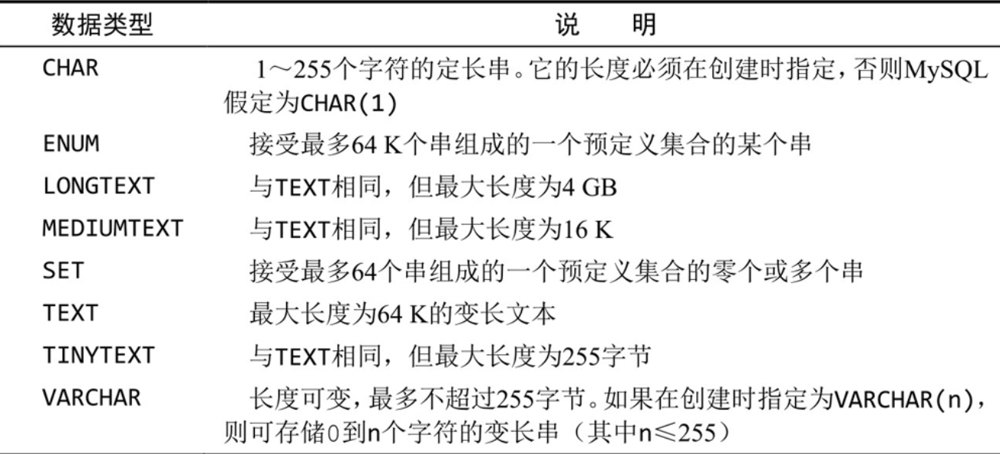


**数值数据类型**

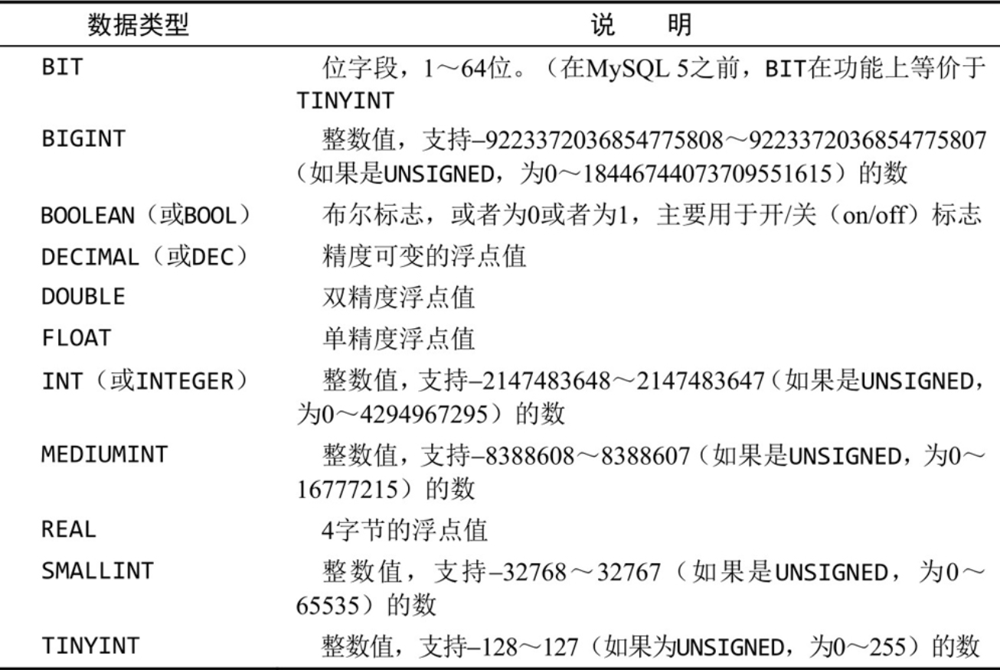


**日期和时间数据类型**

MySQL使用专门的数据类型来存储日期和时间值

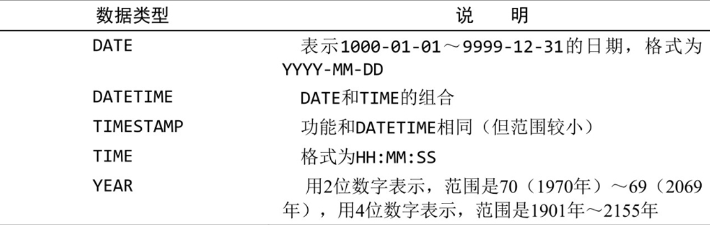


**二进制数据类型**

二进制数据类型可存储任何数据（甚至包括二进制信息），如图像、多媒体、字处理文档等。

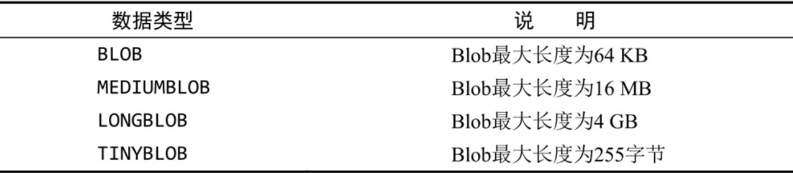


**附录E MySQL保留字**

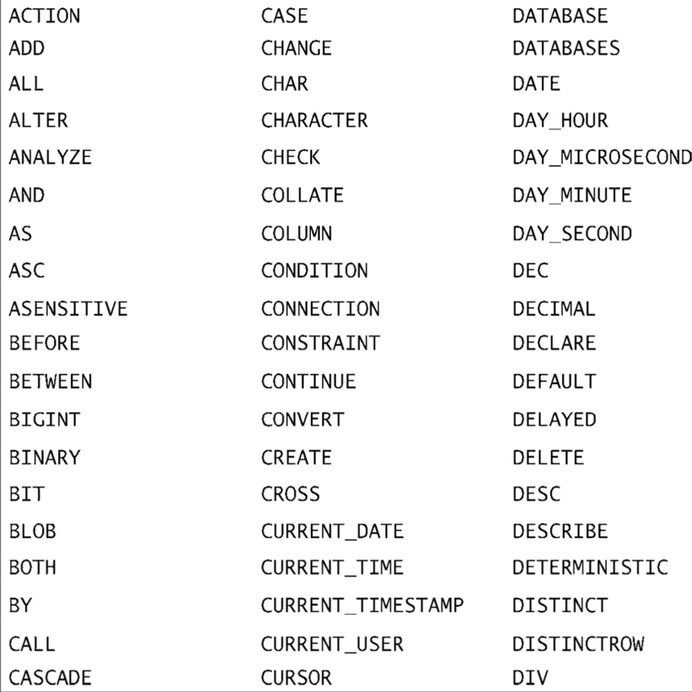

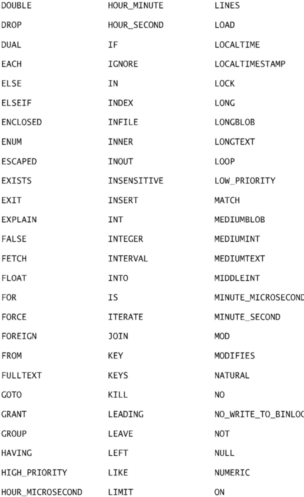

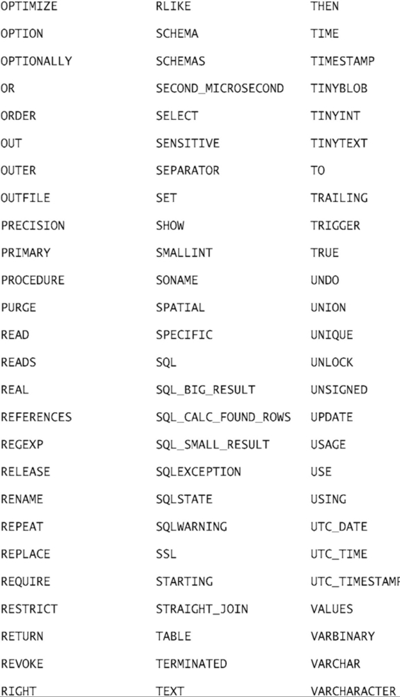


**索引**

索引中的页码为英文原书的页码、与书中边栏的页码一致。

符号* (wildcards)（*通配符）

*=[],71-73，另见matches(regular expressions)

^

-

()

% (wildcards)（%通配符）

；

_ (wildcards)（_通配符）

**A**

access controls（访问控制）

mistakes, preventing（错误，防止）

overview（概述）

user accounts（用户账号）

Administrators (MySQL)advantages of MySQL（MySQL的优点）

AFTER versus BEFORE（AFTER与BEFORE）

Against()aggregate functions（聚集函数），另见individual functions

combining（组合）

joins, utilizing（联结，利用）

overview（概述）

aliases（别名）

alternative uses（替换使用）

concatenating fields（拼接字段）

naming（命名）

table names（表名）

ALL arguments（ALL参数）

ALTER TABLE statements（ALTER TABLE语句）

ANALYZE TABLEanchors (regular expressions)（定位（正则表达式））

AND operators（AND操作符）

application filtering（应用过滤）

AS keyword（AS关键字）

ASCasterisk wildcards（星号通配符）

AUTO INCREMENTauto increment（自动增量）

autocommit flags（自动提交标志）

AVG()


**B**

backing up data（备份数据）

basic character matching（基本字符匹配）, 68-70，另见matches(regularexpressions)

BEFORE versus AFTER（BEFORE与AFTER）

BETWEEN

binary datatypes（二进制数据类型）

Boolean mode（布尔方式）


C


calculated fields（计算字段）

concatenating fields（拼接字段）

mathematical calculations（数学运算）

overview（概述）

subqueries as（子查询作为计算字段）

Cartesian products（笛卡儿积）

case sensitivity（区分大小写）

expression matching（表达式匹配）

full-text searches（全文本搜索）

sort orders（排序顺序）

searches（搜索）

tatements（语句）

character classes (regular expressions)，

matching（字符类（正则表达式），匹配）

character matching（字符匹配）,68-70，另见matches (regular expressions)

characters sets（字符集）

overview（概述）

working with（使用）

CHECK TABLE

clauses（子句）,38，另见individual clauses client-based results formatting（基于客户机的结果格式化）

client-server software（客户机—服务器软件）

collation sequences（校对顺序）

overview（概述）

working with（使用）

column aliases（列别名）

columns（列），另见fieldscommas between names（名字之间的逗号）

definition of（定义）

derived（推导出的）

fully qualified names（完全限定名）

INSERT statements（INSERT语句）

padded spaces（填补空格）

primary keys（主键）

retrieving with SELECT（用SELECT检索）

all（所有列）

individual（单个列）

multiple（多个列）

separating correctly（正确分隔）

sorting by multiple（按多个列排序）

subquery result restrictions（子查询结果约束）

combined queries, creating（组合查询，创建）

command-line (mysql)（命令行（mysql））

command-line utilities（命令行实用程序）

commands（命 令），参 见individual commandscommas 

between column names（列名之间的逗号）

COMMENT keywords（COMMENT关键字）

commits（提交）

committing（提交）

complex joins（复杂联结）

compound queries（复合查询）

creating（创建）

overview（概述）

rows, eliminating/including duplicates（行，删除/包括复制））

rules of（规则）

sorting results（排序结果）

WHERE clause combinations（WHERE子句组合）

concatenating（拼接）

column aliases（列别名）

definition of（定义）

fields（字段）

mathematical calculations（数学计算）

COUNT()COUNT() functions（COUNT()函数）

DISTINCT arguments（DISTINCT参数）

joins（联结）

performing through subquerie（s通过子查询执行）

CREATECREATE TABLE，另见tablesengines（引擎）

statements（语句）

cross joins（叉联结）

currency numbers, storing（货币数，排序）

cursors（游标）

creating（创建）

FETCH statements（FETCH语句）

opening/closing（打开/关闭）

overview（概述）

utilizing（利用）

customers table（customers表）


D

database client-server software interactions（数据库客户机—服务器软件的相互作用）

databases（数据库）

backing up（备份）

compared to Database Management Systems(DBMSs)（与DBMS的比较）

compared to schema（与模式的比较）

definition of（定义）

maintenance, performing（维护，执行）

selecting with USE（用USE选择）

datatypes（数据类型）

binary datatypes（二进制数据类型）

date and time datatypes（日期和时间数据类型）

definition of（定义）

numeric datatypes（数值数据类型）

overview（概述）

string datatypes（串数据类型）

date and time manipulation functions（日期和时间处理函数）

DBMSs (Database Management Systems)（数据库管理系统）

compared to databases（与数据库比较）

performance, improving（性能，改进）

DECLARE statements（DECLARE语句）

DEFAULTDELAYED keywords（DELAYED关键字）

DELETE statements（DELETE语句）

DELETE triggers（DELETE触发器）

delimiters（分隔符）

derived columns（推导出的列），参见aliases DESCDESCRIBE

DISTINCT arguments（DISTINCT参数）

overview（概述）

retrieving distinct rows（检索不同的行）

downloading MySQL（下载MySQL）

DROP PROCEDUREDROP TABLE statement（DROP TABLE语句）

DROP USER


**E**

encoding（编码）

engines（引擎）

error codes（错误代码）

expression matching（表达式匹配），参见matches (regular expressions)


**F**

FETCH statements（FETCH语句）

fields (calculated)（字段（计算）），另见columns

concatenating fields（拼接字段）

mathematical calculations（数学计算）

overview（概述）

FLUSH LOGS statements（FLUSH LOGS语句）

FLUSH TABLES statements（FLUSH TABLES语句）

foreign keys（外键）

formatting（格式化）

FROMfull-text searches（全文本搜索）

Boolean mode（布尔方式）

case sensitivity（区分大小写）

enabling（启用）

engine support（引擎支持）

multiple search terms, ranking（多个搜索项，等级）

overview（概述）

performing（执行）

query expansion（查询扩展）

FULLTEXT clauses（FULLTEXT子 句）

fully qualified table names（完全限定的表名）

functions（函数），另见individual functions

date and time manipulation functions（日期和时间处理函数）

numeric manipulation functions（数值处理函数）

text-manipulation functions（文本处理函数）


**G**

GRANT statements（GRANT语句）

simplifying multiple statements（简化多条语句）

user accounts, creating（用户账号，创建）

user rights（用户权限）

GROUP BYcompared to ORDER BY（与ORDER BY比较）

creating groups with（创建组）

filtering groups with（过滤组）


**H**

HAVING clauses（HAVING子句）

I

IF NOT EXISTSIF statements（IF语句）

IGNOREimplicit commits（隐含提交）

INdefinition of（定义）

utilizing in WHERE clauses（在WHERE子句中使用）IN BOOLEAN MODE,172，另见Boolean mode 

inner joins（内部联结）

InnoDB

description of（描述）

full-text searching support（全文本搜索支持）

INSERT SELECT statement（INSERT SELECT语句）

INSERT statement（INSERT语句）

complete rowsmultiple rows, inserting（多个行，插入）

performance of, improving（性能，改善）

retrieved data, inserting（检索数据，插入）

security privileges（安全权限）

INSERT triggers（INSERT触发器）

installing MySQL（安装MySQL）


**J**

joins（联结）

aggregate functions interaction（聚集函数相互作用）

as system drags（使系统缓慢）

Cartesian products（笛卡儿积）

column names, qualifying（列名，限定）

creating（创建）

cross joins（叉联结）

general guidelines（通用指南）

inner joins（内部联结）

multiple table joins（多表联结）

natural joins（自然联结）

outer joins（外部联结）

overview（概述）

purpose of（用途）

referential integrity, maintaining（引用完整性，维护）

self joins（自联结）

views, simplifying with（视图，简化）

WHERE clause importance（WHERE子句的重要性）


**K**

keywords（关键字）

**L**

left outer joins（左外部联结）

LIKE operators（LIKE操作符），另见wildcards

compared to REGEXP（与REGEXP比较）

limitations of（限制）

utilizing REGEXP like（使REGEXP类似于LIKE）

LIMIT

highest/lowest values, finding（最高/最低值，查找）

retrieving rows（检索行）

local servers, advantages of（本地服务器，优点）

log files, reviewing（日志文件，查看）

logical operators（逻辑操作符），参见operatorslogins (MySQL)（登录（MySQL））

LOOP statements versus REPEAT statements（LOOP语句与REPEAT语句）

LTRIM() function（LTRIM()函数）


**M**

Match()matches (regular expressions)（匹配（正则表达式））

[], utilizing（[]，使用）

anchors（定位符）

character classes, matching（字符类，匹配）

OR matches（OR匹配）

repetition metacharacters（重复元字符）

set matches（集合匹配）

special characters, matching（特殊字符，匹配）

mathematical calculations, performing（数学计算，执行）

mathematical operators（数学操作符）

MEMORY

MIN()

MyISAM

MySQL Administrators

MySQL command-line（MySQL命令行）

MySQL Query Browser

MySQL software（MySQL软件）


**N**

names (fully qualified table names)（名字（完全限定表名））

natural joins（自然联结）

nested groups（嵌套组）

non-numeric data（非数值数据）

nonmatches（不匹配）

NOTNULLchecking

 for with WHERE clauses（用WHERE子句检查）

compared to nonmatches（不匹配比较）

function interactions（函数相互作用）

tables（表）

versus empty strings（NULL与空串）

wildcard searches（通配符搜索）

numeric datatypes（数值数据类型）

numeric manipulation functions（数值处理函数）


**O**

operators（操作符）

definition of（定义）

full-text Boolean mode（全文本布尔方式）

HAVING clause（HAVING子句）

mathematical（数学）

WHERE clauses（WHERE子句）

OPTIMIZE TABLEORmatches（匹配）

overview（概述）

ORDER BYcase sensitivity in sort（排序中区分大小写）

compared to GROUP BY clause（与GROUP BY子句比较）

descending order（降序）

highest/lowest values, finding（最高/最低值，查找）

utilizing（利用）

orders table（orders表）

outer joins（外部连接）


**P**

parameters（参数）

parentheses（圆括号）

grouping related operators（分组相关的操作符）

INpasswords（口令）

percent signs (wildcards)（百分号（通配符））

portability (INSERT statements)（可移植性（INSERT语句））

portable code（可移植代码）primary keys（主键）

definition of（定义）

tables（表）

productnotes table（productnotes表）

products table（products表


**Q**

queries（查询），另见subqueries

building incrementally（增量地建立）

calculated fields（计算字段）

concatenating fields（拼接字段）

mathematical calculations（数学计算）

overview（概述）

combining（组合）

compound queries（复合查询）

creating（创建）

rows, eliminating/including duplicates（行，删除/包括复制）

rules of（规则）

sorting results（排序结果）

definition of（定义）

formatting effectively（有效地格式化）

WHERE clauses, combining with（WHERE子句，组合）

Query Browser (MySQL)query expansion (full-text searches)（查询扩展（全文本搜索））

quotes（引号）

numeric datatypes（数值数据类型）

string datatypes（串数据类型）

utilizing in WHERE clauses （在WHERE子句中使用）


Rrange values, checking（范围值，检查）records compared to rows（记录与行比较）referential integrity, maintaining（引用完整性，维护）REGEXPregular expressions（正则表达式）^basic character matching（基本字符匹配）limitations of（限制）matches（匹配），参见matches (regular expressions)overview（概述）ranges, defining（范围，定义）testing（测试）whitespace metacharacters（空白元字符）relational tables（关系表）RENAME TABLEREPAIR TABLEREPEAT statements（REPEAT语句）repetition metacharacters (regular expressi-ons)（重复元字符（正则表达式））reserved words（保留字）REVOKE statements（REVOKE语句）

right outer joins（右外部联结）rollbacks（回退）ROLLUProot dangers（root的危险）rows（行）complete rows, inserting（完整行，插入）definition of（定义）duplicates, eliminating/including（复制，删除/包含））limiting retrieve results（限制检索结果）multiple rows, inserting（多行，插入）retrieving（检索）RTRIM() function（RTRIM()函数）


**S**

savepoints（保留点）

scalability（可伸缩性）

schema（模式）

scripts, executing（脚本，执行）

searches（搜索）SELECT（查询），另见queries

AS keyword（AS关键字）

columns, retrieving（列，检索）

all（全部列）

individual（单个列）

multiple（多个列）

concatenating fields（拼接字段）

purpose of（用途）

sequencing（排序）

self joins（自连接）

semicolons（分号）

server software（服务器软件）

server-based results formatting（基于服务器的结果格式化）

SET PASSWORD statements（SET PASSWORD语句）

sets, matching regular expressions（集合，匹配正则表达式）

SHOWSHOW PROCEDURE STATUS

sign values（符号值）

signed datatypes（有符号的数据类型）

sorting data（排序数据）

by multiple columns（按多个列）

case sensitivity（区分大小写）

in descending order（以降序）

overview（概述）

SOUNDEX() function（SOUNDEX()函数）

spaces, removing（空格，删除）

special characters (regular expressions)（特殊字符（正则表达式））

SQLstartup problems, diagnosing（启动问题，诊断）

statement syntax（语句语法）

statements（语句），另见individual statements

 formatting（格式化）overview（概述）

stopwords（非用词）

stored procedures（存储过程）

creating（创建）

cursors（游标），参见cursors

disadvantages of（缺点）

dropping（删除）

executing（执行）inspecting（检查）

intelligent stored procedures, building（智能存储过程，建立）

overview（概述）

parameters（参数）

uses for（使用）

string datatypes（串数据类型）

subqueries（子查询），另见WHERE clauses

as  calculated fields（作为计算字段）

combining queries with（查询与子查询组合）

definition of（定义）

filtering by（用子查询过滤）

formatting effectively（有效地格式化）

order of process（处理次序）

self joins（自联结）

UPDATE statements（UPDATE语句）

SUM()

syntax（语法）

joins（联结）

statements（语句）


**T**

tables（表）

aliasing（起别名）

AUTO INCREMENT

calculated fields（计算字段）

concatenating fields（拼接字段）

mathematical calculations（数学计算）

overview（概述）

Cartesian products（笛卡儿积）

character sets, specifying（字符集，说明）

creating（创建）

customers table（customers表）

default values, specifying（默认值，说明）

DELETE statements（DELETE语句）

deleting（删除）

joins（联结）

multiple tables, joining（多个表，联结）

NULL values（NULL值）

orderitems table（orderitems表）

orders table（orders表）

overview（概述）

overwriting（覆盖）

primary keys（主键）

productnotes table（productnotes表）

products table（products表）

relational tables（关系表）

renaming（重命名）updating（更新）

vendors table（vendors表）

views（视图），参见views

text（文本）

text-manipulation functions（文本处理函数）

time datatypes（时间数据类型）

trailing space dangers in wildcards（通配符中尾空格的危险）

transactions（事务处理）

controlling（控制）

engine support（引擎支持）

overview（概述）

triggers（触发器）

BEFORE versus AFTER（BEFORE与AFTER）

creating（创建）

DELETE triggers（DELETE触发器）

dropping（删除）

failure of（故障）

guidelines（指南）

INSERT triggers（INSERT触发器）

multi-statement triggers（多语句触发器）

overview（概述）

UPDATE triggers（UPDATE触发器）

TRIM()trimming padded spaces（去头尾空格）

TRUNCATE TABLE

**U**

underscores (wildcards（) 下划线（通配符））

UNION operators（UNION操作符）,158，另见compound queries

UNSIGNED keywords（UNSIGNED关键字）

UPDATE statements（UPDATE语句）

UPDATE triggers（UPDATE触发器）

USEuser accounts（用户账号）

access rights, setting（访问权限，设置）

creating（创建）

deleting（删除）

managing（管理）

passwords, changing（口令，更改）

renaming（重命名）

**V**

VALUES

variables（变量）

vendors table（vendors表）

versions of MySQL（MySQL版本）

views（视图）

calculated fields（计算字段）

common uses for（普通使用）

complex joins, simplifying（复杂联结，简化）

data, reformatting（数据，重新格式化）

overview（概述）

performance issues（性能问题）

reusable views（可重用视图），

creating（创建）

rules and restrictions（规则和约束）

unwanted data, filtering（不需要的数据，过滤）

updating（更新）

utilizing（利用）


**W**

WHERE clauses（WHERE子句），另见SELECT 

checking against single values（检查单个值）

checking for nonmatches（不匹配检查）

combining（组合）

combining AND/OR（组合AND/OR）

combining queries（组合查询）,153，另见compound queries

compared to UNION（与UNION比较）

dates, filtering by（日期，过滤）

filtering groups（过滤组）

importance of in joins（在联结中的重要性）

INNOTNULL values（NULL值）operators（操作符）

overview（概述）

parentheses（圆括号）

quotes, utilizing（引号，利用）

range values, checking（范围值，检查）

whitespace metacharacters（空白元字符）

regular expressions（正则表达式）

statements（语句）

wildcards（通配符）

*

%

_

guidelines for（指南）

LIKE operator compared to REGEXP（LIKE操作符与REGEXP的比较）

limitations of（限制）

NULL interaction（与NULL的相互作用）

trailing spaces, dangers of（尾空格，危险）

WITH ROLLUP

